# 美国人的口粮并不依赖地下水：小麦生产与灌溉数据深度解析

> **一句话总结**：美国核心主粮（小麦）的灌溉比例极低（约 5.7%），地下水消耗主要流向玉米和棉花，因此地下水枯竭对美国主粮安全的直接威胁远低于外界预期。

## 核心观点 (Key Takeaways)
- **主粮界定**：讨论美国粮食安全需聚焦小麦。大米消费量极低，玉米则主要用于饲料或工业，而非直接口粮。
- **低灌溉依赖**：全美小麦种植的灌溉面积占比仅为 5.676%（2022年数据），远低于全美农田 17% 的平均灌溉率。
- **地理分布差异**：
    - **北部大平原**：小麦产量占比约 30%，基本不依赖灌溉。
    - **西北三州**：虽依赖灌溉，但 74% 的水源来自哥伦比亚河等地表水。
    - **含水层区域**：奥加拉拉含水层上的地下水主要被用于种植耗水的玉米（中北部）和棉花（南部）。
- **抗风险能力**：即使禁绝地下水灌溉，对小麦总产量的冲击预计仅在一成左右（灌溉产占比约 10.9%）。

## 关键数据与证据 (Fact Sheet)
- **小麦灌溉率**：2,112,190（灌溉面积） / 37,211,994（总面积） = **5.676%**（2022年 USDA 普查）。
- **单产对比**：灌溉小麦单产（89 蒲式耳/英亩）约为全体小麦单产（47.6 蒲式耳/英亩）的 **2 倍**。
- **产量贡献**：2018 年灌溉小麦产量约占总产量的 **10.9%**。
- **局部灌溉比例**：大平原中部（含水层核心区）小麦灌溉面积仅占 **4.5%**；南部占 **7%**。

---

## 原始文本清洗版 (附图证)

因为美国人的口粮并不依赖地下水。很多回答从地理气候、人文、经济、制度等等方面谈及美国在地下水超采这一块有严重的问题，尤其是奥加拉拉含水层与加州中央谷地。我完全同意，这些地方的农业可持续性有很大的隐患。但地下水是否威胁了美国的粮食安全？由于美国人基本不吃大米，玉米也主要作为饲料粮，所以实际上只讨论小麦。

### 1. 灌溉面积统计
根据 USDA 2022 年农业普查数据：
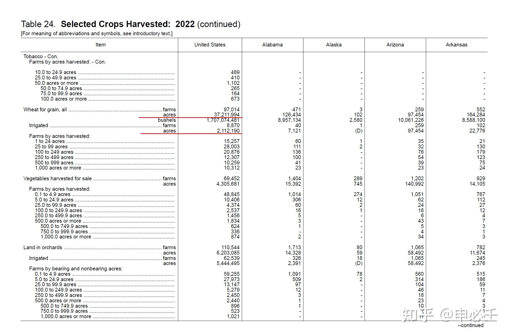
*图1：谷物用小麦，种植面积单位为英亩，产量单位为蒲式耳*

全美小麦种植地中，灌溉面积占比仅为 5.676%，不及农田平均灌溉率 17%。上一次普查数据也基本一致：
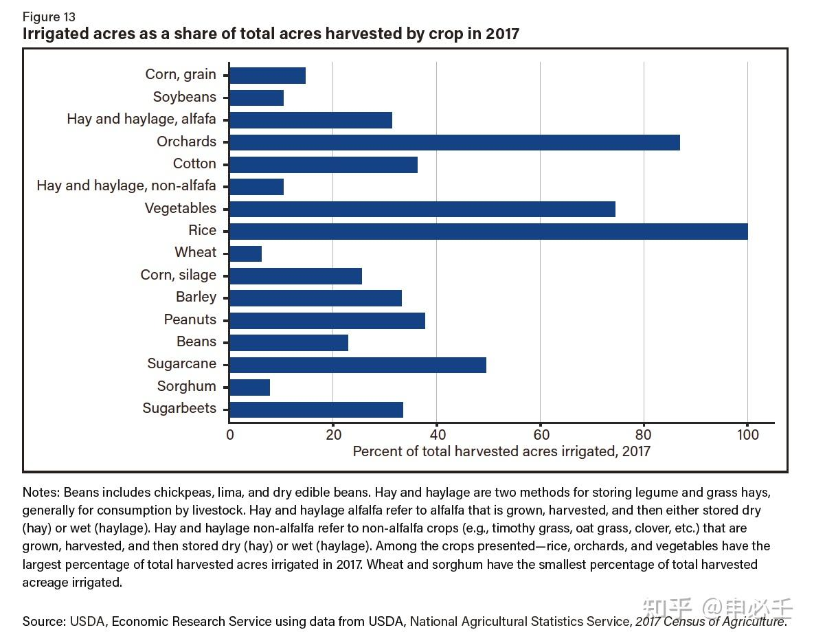
*图2：小麦灌溉面积占比甚至比耐旱的高粱还低*

### 2. 单产与产量贡献推测
USDA 2018 年专项说明显示：
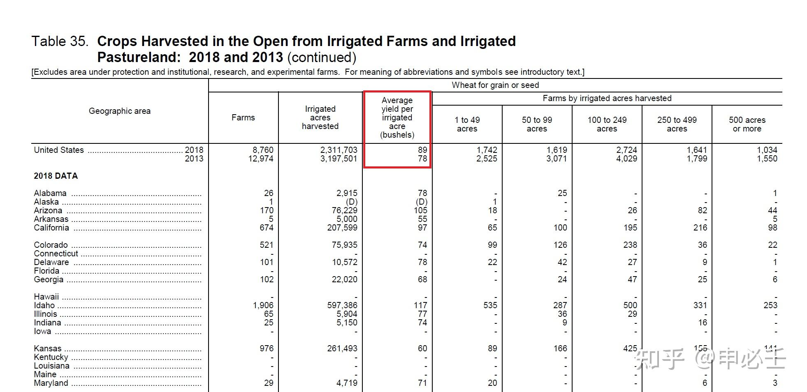
*图3：2018小麦灌溉单产约 89 蒲式耳/英亩*

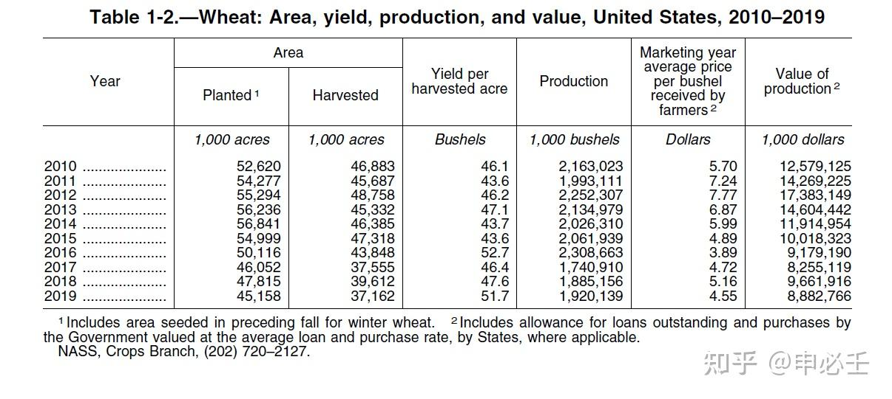
*图4：2018小麦总单产约 47.6 蒲式耳/英亩*

由此可知，灌溉小麦单产为全体小麦单产的两倍左右，灌溉产量占比大致维持在一成左右。

### 3. 遥感影像与地理分析
在美国大农田中，是否灌溉通过遥感影像非常容易辨认：
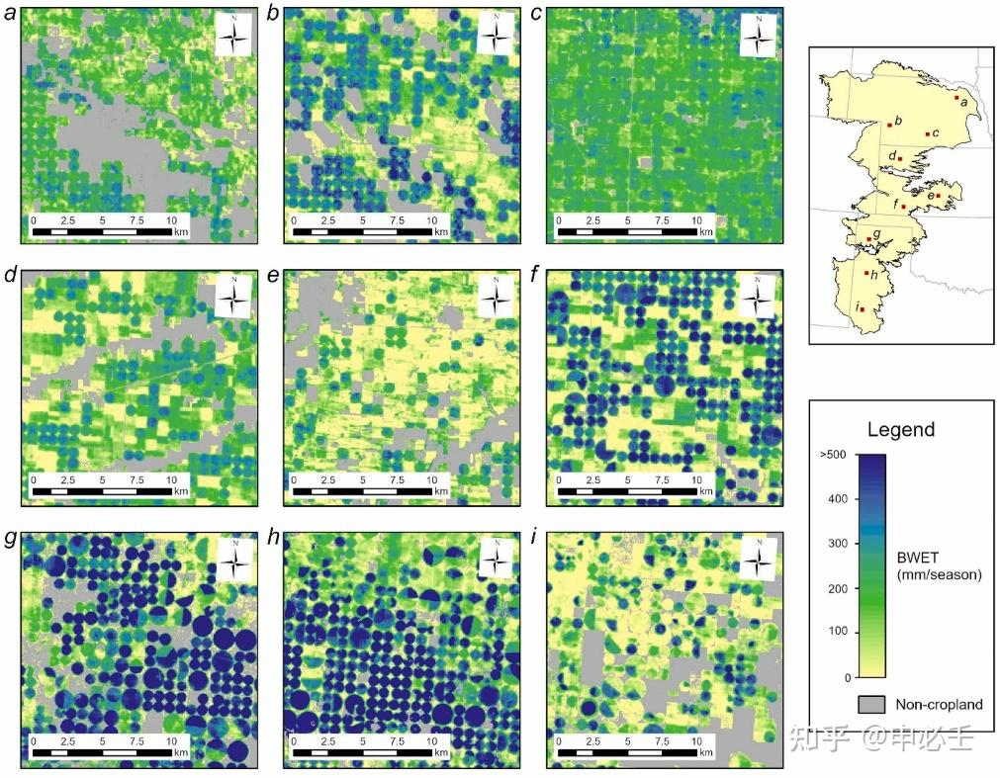
*图5：含水层上的圆形喷灌农田*

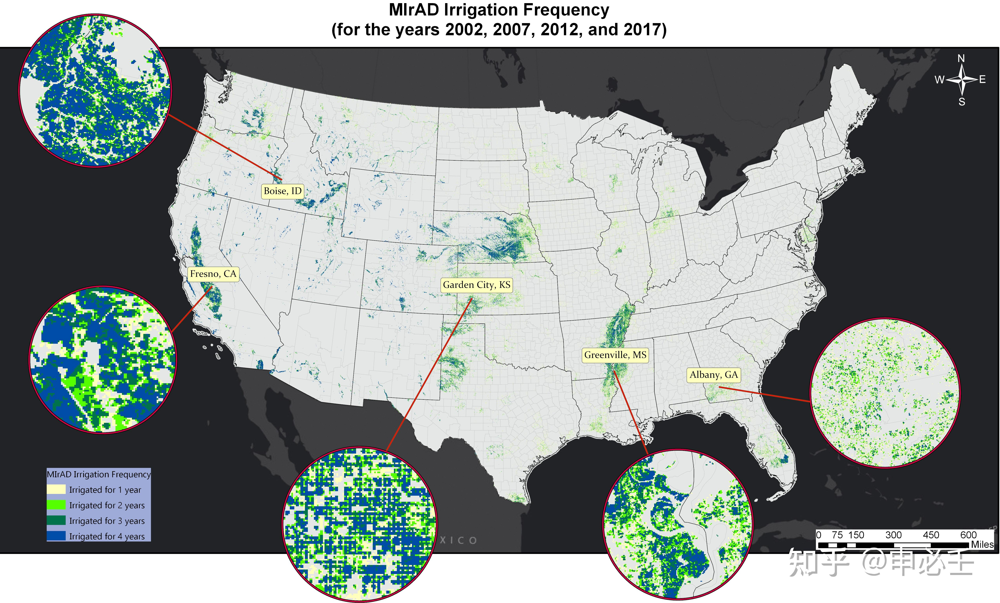
*图6：基于遥感识别的灌溉区分布*

对比小麦种植区：
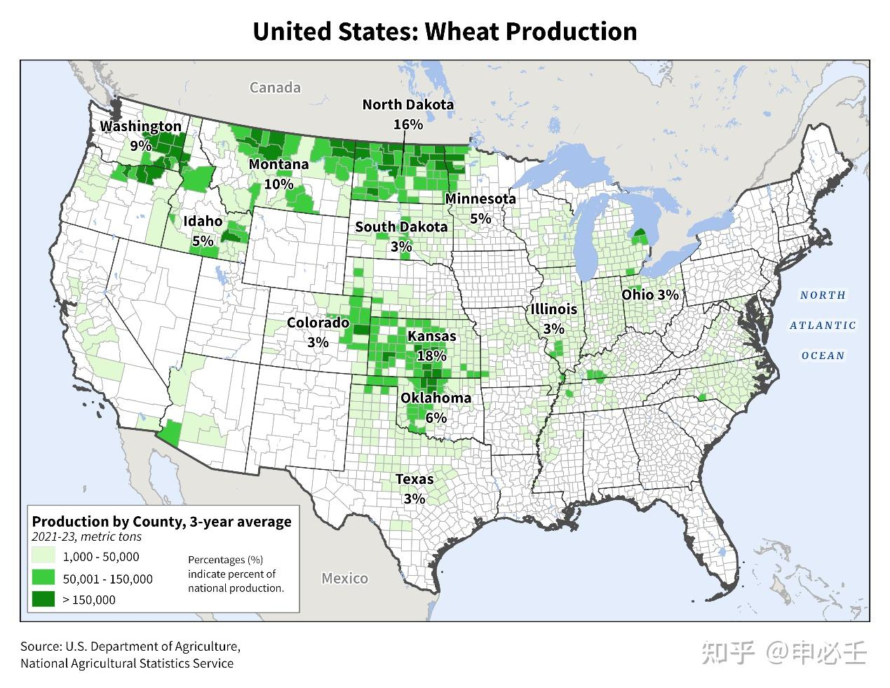
*图7：小麦主产区分布*

### 4. 区域依赖度分析
大平原中部和南部小麦种植的灌溉程度依旧不算高：
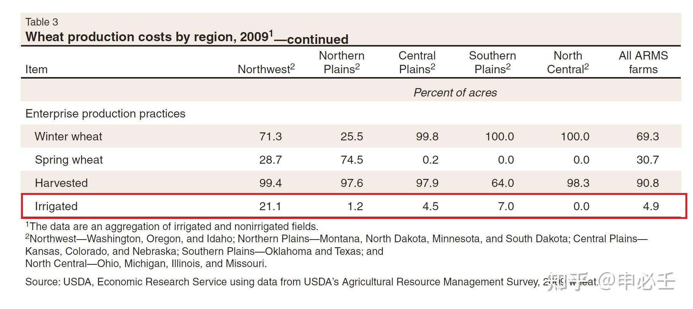
*图8：不同区域小麦灌溉面积展示*

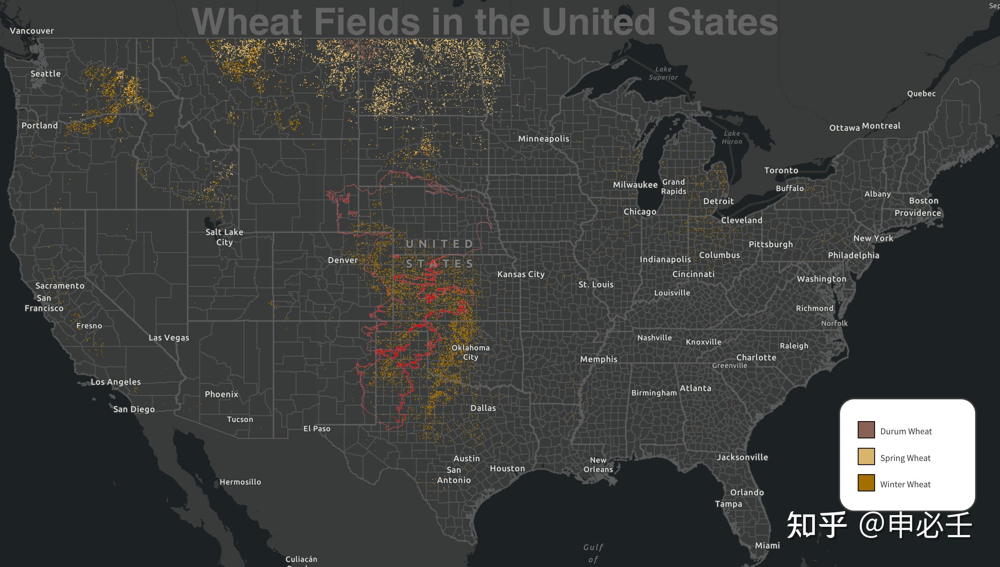
*图9：奥加拉拉含水层边界与小麦种植带，东部密集区基本不靠灌溉*

### 5. 耗水作物真相
为什么含水层上抽水严重却跟小麦关系不大？
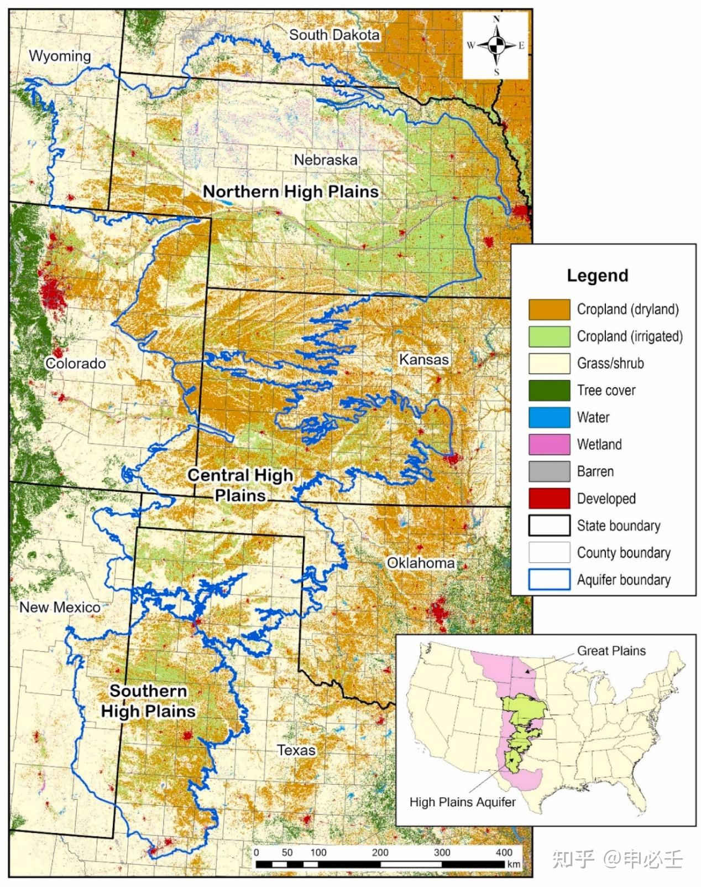
*图10：含水层上的耕地很多也是不需灌溉的旱地小麦*

真相是，地下水主要被用于种植耗水的**玉米**和**棉花**：
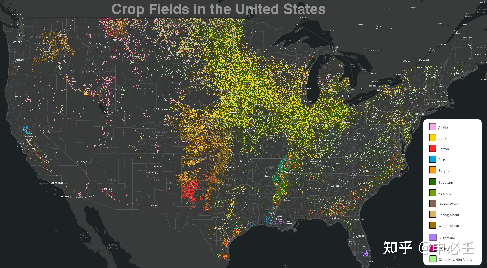
*图11：红色为棉花，亮黄为玉米*

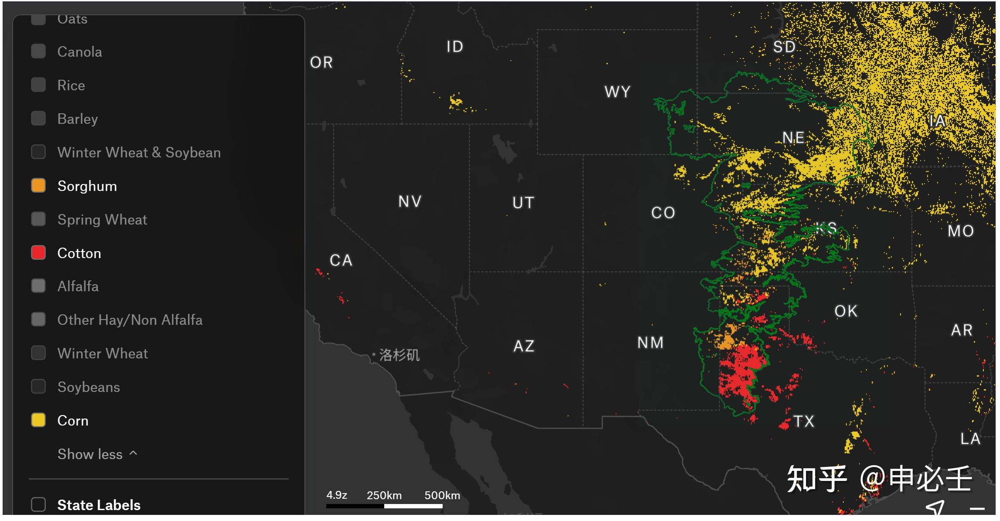
*图12：在干旱区种高耗水作物是地下水超采的主因*

### 6. 西北灌区情况
西北华盛顿等州虽有灌溉，但 74% 水源来自哥伦比亚河等外来地表水，地下水仅占 26%。

---
**参考：**
1. 2018 Irrigation and Water Management Survey Table 35.
2. USGS Scientific Investigations Report 2012–5261.
