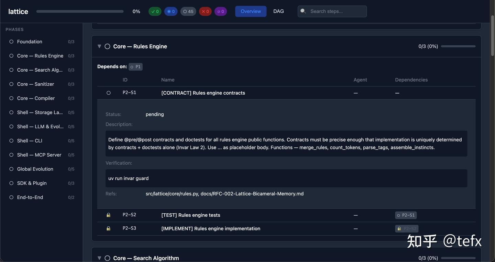
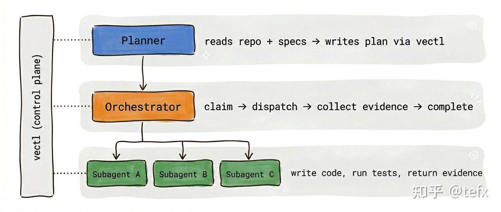

# vectl: 让 AI Agent 从“看心情”到“按规矩”干活的执行控制面

> **一句话总结**：`vectl` 通过将开发计划转化为带有依赖关系的有向无环图（DAG），并引入申领机制与证据提交，解决了大型项目中 AI Agent 跳步骤、重复劳动及多 Agent 并行冲突的问题。

## 核心观点 (Key Takeaways)
- **TODO.md 的局限性**：在 Agent 眼里，Markdown 仅是参考而非命令，缺乏强制执行力。一旦计划达到百步以上，Agent 容易迷路、重复或跳步，且无法证明任务是否真实完成。
- **控制面概念**：`vectl` 不是框架，而是控制面（Control Plane）。它控制 Agent 能看到什么（未解锁步骤不可见）、何时看到，以及任务完成的证明（Evidence）。
- **硬约束机制**：
    - **DAG 依赖**：通过 `plan.yaml` 显式定义 `depends_on`，实现硬性的执行顺序。
    - **申领与验证**：先 `claim` 任务再开工，完成后提交 `evidence`（如测试结果、PR 链接），否则无法标记为完成。
- **并发与协作**：引入 **CAS 乐观锁** 防止多个 Agent 同时编辑冲突；支持 `checkpoint` 和 `clipboard` 工具防止会话压缩丢失状态。
- **三层分离模式**：推荐 **Planner**（拆解计划，推荐 Opus 4.6）、**Orchestrator**（任务调度，推荐 GPT-5.3-Codex）与 **Subagent**（执行编码）分工协作。

## 关键数据与证据 (Fact Sheet)
- **工具集**：提供 **14 个 MCP 工具** 供 Agent 直接调用，比 CLI 命令更可靠。
- **并行能力**：调度者默认支持 **3 路并行**。
- **自举成功**：作者声称 `vectl` 本身是完全依靠 `vectl` 流程自举生成的（即 Agent 在该流程管理下编写了所有代码）。
- **核心逻辑**：所有计划改动必须走 `mutate` 工具，以保证校验和原子写入，严禁 Agent 手写 `plan.yaml`。

---

## 原始文本清洗版 (Original Content)

Claude Code、OpenCode 写代码越来越多。项目一大，自然就攒出一份巨长的 TODO.md。
然后你就会发现一个很恼火的事——agent 根本不把你的 TODO.md 当回事。

Markdown 管不住 Agent
你肯定经历过这种场景：写了一份巨详细的开发计划，100 步、200 步，甚至更多。你心想这下 agent 应该能按顺序干了吧，做完一步勾一步，别跳。
结果呢？它就是不听。跳步骤是家常便饭，做完了也懒得勾 checkbox，或者在 1000 行的计划里彻底迷路了，开始重复做你已经做完的东西。你越想靠加粗、加注释、加分隔线来"暗示"它，效果越差——Markdown 说到底就是一坨自然语言文本，agent 又不是你下属，它对这些没有任何"必须执行"的概念。

说白了：TODO.md 在 agent 眼里就是个参考，不是命令。你没办法强制它先领任务再开工、没办法强制它做完了交证据。 而且计划一长，agent 的注意力就开始漂移——该看的没看到，不该做的做了一遍，顺便还把 token 烧了。

这不是 agent 傻，是 Markdown 本身就不干这个事：
- 管不住：你拦不住 agent 跳步骤，也没法要求它证明"我真的做完了"
- 没有依赖："部署数据库"写在"配置应用"前面——agent 猜一下有没有先后关系，猜错了？没人管
- 多 agent 打架：几个 agent 同时在线，谁也不知道别人在干嘛，同时改一个文件谁赢全看运气
- 嘴上完成：agent 说一声"搞定了"就算搞定了，你也没法让它把测试结果贴出来看看

十几步的小计划还凑合。一旦上了百步、上了多 agent，TODO.md 基本就是摆设了。

TODO.md 没法说"不"。

所以我搞了 vectl
vectl 是一个给 AI agent 用的执行控制面。注意，是控制面（Control Plane），不是又一个 agent 框架。
框架管 agent 怎么思考。vectl 管的是另一回事：agent 能看到什么、什么时候能看到、做完了怎么证明。

思路其实很简单：
1. 把计划写成一个有依赖关系的 DAG（有向无环图），存成一个 plan.yaml
2. 没解锁的步骤 agent 压根看不到——不是"请你别做"，是"你都不知道有这个东西"
3. 想做？先 claim。做完了？交证据。没证据不算完。

就这么点事，但解决了一堆老大难：
- Agent 乱跳：没解锁的步骤直接不显示
- 做完不打勾：不交证据就没法标完成
- 依赖全靠猜：显式 depends_on 字段
- agent 一起编辑：CAS 乐观锁，撞了直接报错
- 换个会话或者压缩后啥都忘：checkpoint 和 clipboard 工具
- 不知道该派谁：步骤可指定 suggested agent，自动按亲和度派活
- 不知道谁干的：每步记录 claimed_by + evidence，天然审计链

TODO.md 没法说"不"。vectl 可以。

你需要干什么？
你管方向，agent 管干活，vectl 管 agent。

1. 初始化：uvx vectl init --project my-project
2. 让 Agent 连上 vectl：推荐走 MCP，vectl 有 14 个 MCP 工具。
3. 写计划：让 agent 通过 vectl 的 mutate 工具自己生成计划。

计划示例（YAML）：
version: 1
project: my-project
phases:
  - id: auth
    steps:
      - id: auth.user-model
        status: done
        evidence: "pytest passed, see PR #42"
      - id: auth.jwt
        status: pending
        depends_on: [auth.user-model]

日常操作：
uvx vectl render # 导出 Markdown 进度报告
uvx vectl dashboard --open # 打开 Dashboard 看 DAG 图

至于领任务、写代码、跑测试、交证据——那都是 agent 的事。

什么时候需要它？
- 计划膨胀到几十上百步
- 多个 agent 要并行
- 跨会话、跨工具状态不能丢
- 想看证据

进阶玩法：三层分离（规划、调度、执行彻底分开）
- Planner（规划者）：拆 phase 和 step，定依赖和验收标准，推荐用 Opus 4.6。
- Orchestrator（调度者）：派活、收活，管并发（默认 3 路并行），推荐 GPT-5.3-Codex。
- Subagent（干活的）：接到任务就埋头干，写代码跑测试。

vectl 本身就是自举的。作者一行代码没写，完全靠这套流程生产了 vectl。
