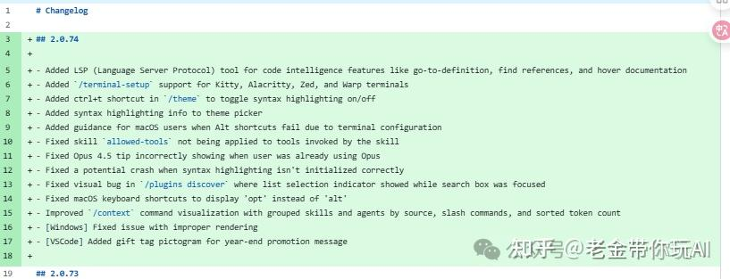
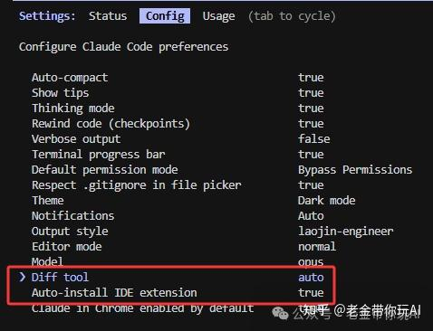
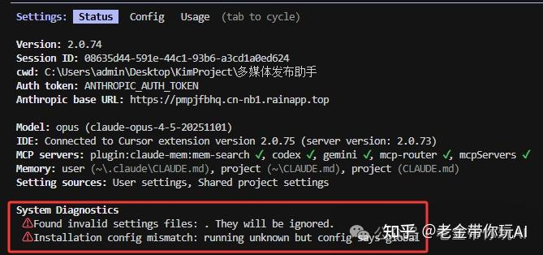

# Claude Code 2.0.74 更新：LSP 配置全指南

> **一句话总结**：Claude Code 2.0.74 正式上线了 LSP (Language Server Protocol) 支持，通过语义级的代码理解显著提升搜索精度并降低 40% 以上的 Token 消耗。

## 核心观点 (Key Takeaways)
- **LSP = 让编辑器长脑子**：不同于传统的 Grep 文本搜索，LSP 让 AI 能够理解函数定义、类型、引用等语义结构。
- **降低成本**：在大型项目中，LSP 避免了反复进行全局文本搜索，大幅节省了上下文 Token。
- **配置多样性**：支持 VS Code 自动集成、社区版 cclsp 方案以及手写 `.lsp.json` 配置文件。
- **自动化工作流**：配置完成后，Claude Code 会在后台自动优先调用 LSP 接口，用户无需改变交互方式。

## 关键数据与证据 (Fact Sheet)
- **40% 以上**：Milvus 团队实测使用 LSP 后 Token 消耗降低的比例。
- **2.0.74 版本**：LSP 正式上线的版本号（实验性支持始于 2.0.30）。
- **7 个核心操作**：支持 goToDefinition（跳转定义）、findReferences（查找引用）、hover（悬停信息）、documentSymbol（文档符号）、workspaceSymbol（工作区搜索）、goToImplementation（跳转实现）、incomingCalls/outgoingCalls（调用链）。
- **10,000 行代码**：推荐配置 LSP 的项目体量门槛。

---

## 原始文本清洗版 (Original Content)

Claude Code 更新了 2.0.74。其更新日志显示，本次更新的重点是 LSP（Language Server Protocol）。

### LSP 是个啥
LSP 即 Language Server Protocol。说人话：它是让编辑器“长脑子”的技术。在 VS Code 里按 Ctrl 点击函数名跳转到定义，或鼠标悬停显示类型，背后的支撑技术就是 LSP。
- **没有 LSP**：AI 把代码当文本，用 Grep 搜字符串，结果繁杂且需要二次判断。
- **有了 LSP**：AI 直接问语言服务器要精确位置，一次到位。

在 Claude Code 中，LSP 是隐性的。运行 `/config` 看不到显式的开关。

### LSP 的三种配置方式

1. **VS Code 集成（最简单）**
   如果你使用 VS Code，在终端启动 `claude` 后运行 `/config`。
   - **Diff tool** 设为 `auto`：检测到 VS Code 后会自动调起 LSP。
   - **Auto-install IDE extension** 保持 `true`：自动安装通信扩展。

2. **cclsp 社区方案**
   不依赖 IDE，纯终端使用。通过 `npx cclsp@latest setup` 安装。这是社区做的 MCP 服务器，特点是能自动修正 AI 生成的行列号误差。

3. **手动配置 .lsp.json**
   在项目根目录创建文件，手动指定各语言的 server 命令：
   - TypeScript: `typescript-language-server --stdio`
   - Python: `pylsp`

### 为什么需要 LSP
老金（原文作者）指出，在大半年使用中最大的困扰是 Token 消耗。每次修改函数、找引用、跳定义都要全局 Grep，极其烧钱。根据 Milvus 团队实测，LSP 能降低 40% 以上的 Token 消耗。

### 核心支持功能
1. goToDefinition（跳转定义）
2. findReferences（查找引用）
3. hover（悬停信息）
4. documentSymbol（文档符号）
5. workspaceSymbol（工作区搜索）
6. goToImplementation（跳转实现）
7. incomingCalls/outgoingCalls（调用链图）

### 2025 年 12 月实测坑位
- 官方目前没有明确的 LSP 启动指示器。
- "No LSP server available" 通常是因为本地语言服务器（如 typescript-language-server）未安装。
- 跨文件引用有时仍有延迟或不全。

### 总结
未来 AI 编程工具，LSP 是标配。谁能更好理解代码结构，谁就能生成更准的代码。

**参考来源**：
- cclsp GitHub: https://github.com/ktnyt/cclsp
- Milvus Blog: 为什么反对 Grep-only 检索
- Claude Code 2.0.74 更新日志：新增 Kitty/Alacritty/Zed/Warp 终端支持。
