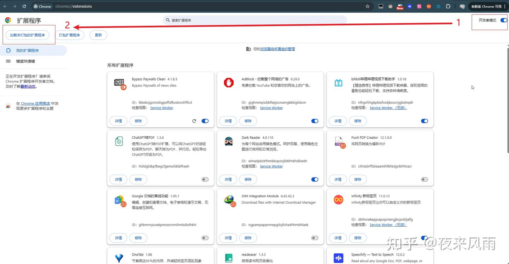
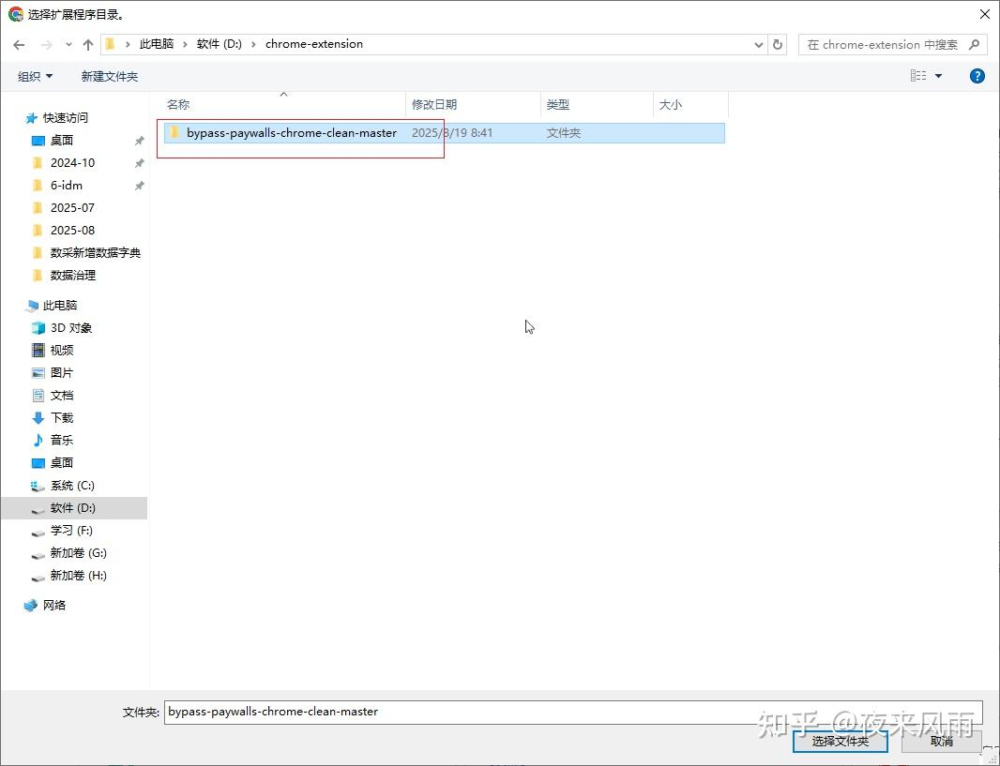
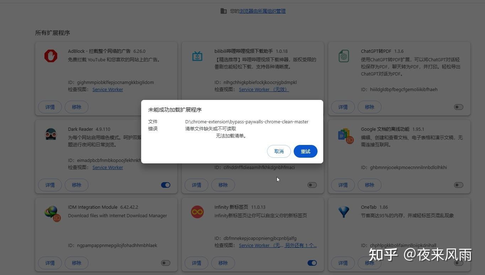
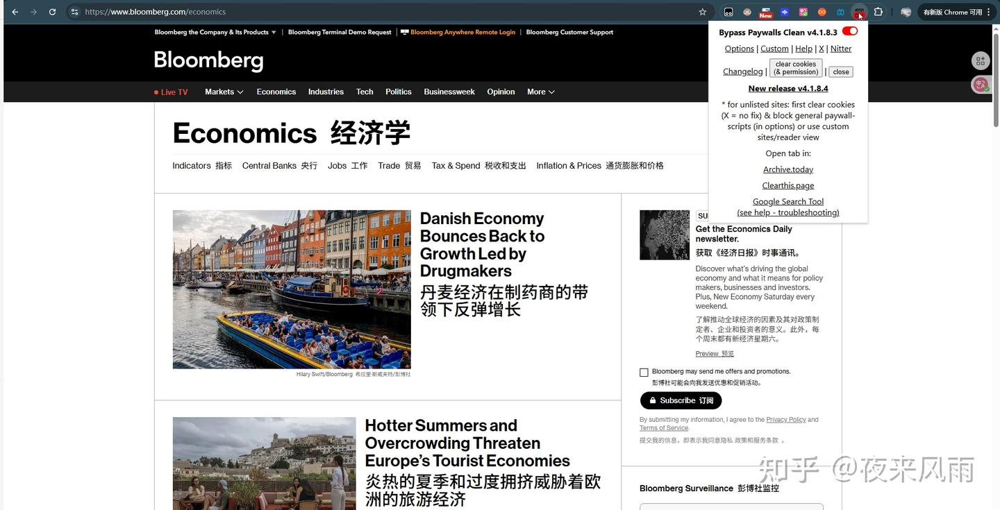
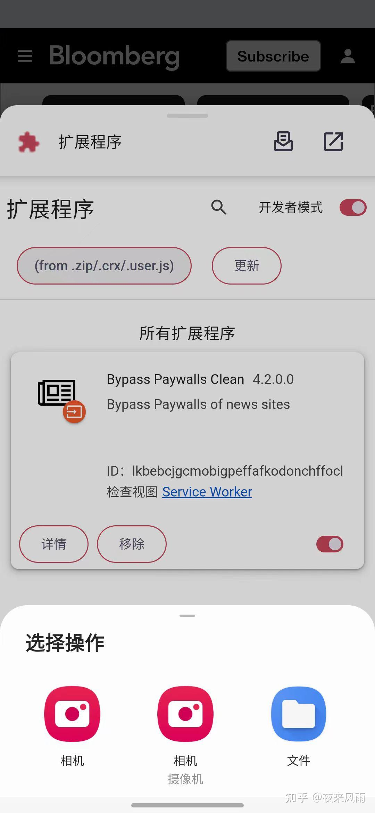

# bypass-paywalls-chrome-clean：绕过付费墙的浏览器插件解决方案

> **一句话总结**：这是一个由俄罗斯开发者维护的开源浏览器插件，可帮助用户绕过全球主流媒体付费墙直接阅读内容，支持50+知名媒体网站，最新版本更新于2026年2月19日。

## 核心观点 (Key Takeaways)
- 解决订阅费用问题，可免费访问彭博社、华尔街日报、经济学人等知名付费媒体
- 由俄罗斯开发者 **magnolia1234** 开发和维护，持续更新超过一年
- 支持多平台：Chrome、Edge、Firefox、360浏览器及安卓手机
- 支持绕过付费墙的媒体覆盖全球主要英语和非英语媒体，包括美、英、法、德、意、加、澳、亚、拉美等地区
- 安装方式：通过开发者模式加载未打包扩展（解压crx/xpi文件后加载）

## 关键数据与证据 (Fact Sheet)
- **项目名称**：bypass-paywalls-chrome-clean
- **开发者**：magnolia1234（俄罗斯）
- **最新版本发布日期**：**2026年2月19日**
- **项目持续更新时间**：超过1年
- **支持媒体数量**：13个分类，约50+媒体网站
- **支持平台**：Chrome、Edge、Firefox、360浏览器、安卓手机（通过Quetta/Kiwi浏览器）
- **蓝奏云下载密码**：zhihu
- **代码安全性**：经ChatGPT Codex审查，无明显后门代码

### 支持媒体分类清单

| 分类 | 支持网站 |
|------|---------|
| 国际/美国主流媒体 | The New York Times、Washington Post、CNN、Fox News、LA Times、USA Today |
| 商业/财经 | Bloomberg、Forbes、Fortune、Harvard Business Review、WSJ、Barron's、MarketWatch |
| 科技/学术 | Nature、Science、Scientific American、MIT Technology Review、National Geographic |
| 杂志/评论/博客 | The Atlantic、The New Yorker、Foreign Affairs、Foreign Policy、Politico、Wired |
| 体育 | ESPN、Sports Illustrated、The Athletic、CyclingNews |
| 英国/爱尔兰 | The Times、Financial Times、The Telegraph、The Economist、The Guardian（部分） |
| 法国 | Le Monde、Le Figaro、Les Échos、Libération、Le Parisien |
| 德国/奥地利 | Der Spiegel、Die Zeit、Süddeutsche Zeitung、Handelsblatt、Bild |
| 意大利/西班牙 | Corriere della Sera、La Repubblica、El País、El Mundo、La Vanguardia |
| 加拿大 | The Globe and Mail、Toronto Star、National Post、Le Devoir |
| 澳大利亚/新西兰 | The Australian、Sydney Morning Herald、The Age、New Zealand Herald |
| 亚洲 | SCMP、CommonWealth Magazine、The Hindu、Times of India、Nikkei、Japan Times |
| 拉美 | La Nación（阿根廷）、O Globo（巴西）、El Mercurio（智利）、El Universal（墨西哥） |

### 重要限制说明
- 部分网站仅支持免费文章
- Science、Nature等论文期刊采用"硬付费墙"，只能阅读部分免费文章
- 华尔街日报需登录账号后才可破解（区分wsj和wsj中文网，后者未破解）
- 财新网**无法破解**
- 明镜周刊(Der Spiegel)如无法破解，可使用archive.ph存档网站
- 部分"限量阅读"网站可通过清除Cookie继续访问
- 访问国外网站需要梯子

## 安装指南

### 谷歌浏览器安装步骤
1. 地址栏输入 `chrome://extensions/` 或设置→扩展程序
2. 开启"开发者模式"
3. 点击"加载未打包的扩展程序"
4. 选择解压后的文件夹
5. 如遇加载失败，重复第4步即可

### 安卓手机安装
- 推荐浏览器：**Quetta浏览器**
- 路径：设置 → 扩展 → 开发者选项 → from .zip/.crx/user.js → 选择crx插件导入
- 备选：**Kiwi浏览器**（已停止更新）

### 其他浏览器
- Firefox使用xpi格式
- Edge/360/Chrome使用crx格式

### 推荐配套工具
- **翻译插件**：沉浸式翻译（配合DeepL API，性价比高，但曾被曝隐私问题需留意）
- **论文获取**：SCI-HUB、arXiv
- **存档网站**：archive.ph

### 谷歌浏览器无法安装crx解决方案
Chrome 35版本后禁止非应用商店插件，解决方案参考：[GitHub Issues](https://github.com/xiaodongxier/iTools/issues/50)

### 替代安装方法
直接将解压后的文件夹拖到浏览器扩展管理界面也可安装。

---

## 原始文本清洗版 (Original Content)

很多人因为订阅费用的问题，看不了《彭博社》《华尔街日报》《经济学人》等知名媒体的文章。这里推荐一个由俄罗斯大神**magnolia1234**开发的开源项目**bypass-paywalls-chrome-clean**。这是一个浏览器插件，可以帮助用户绕过大多数知名网站的付费墙，直接阅读内容。该项目目前已持续更新一年，最新版本发布于**2026 年 2 月 19 日**，因此短期内不用担心失效问题。

**项目地址：**
https://gitflic.ru/project/magnolia1234/bypass-paywalls-chrome-clean

**项目原始安装包地址：**
插件原始安装包地址：gitflic.ru/project/magnolia1234/bpc_uploads

**项目介绍**：该项目可以绕过大多数知名网站的付费墙。支持网站如下：

| 分类 | 网站（英文名 + 中文名） |
|------|------------------------|
| 国际 / 美国主流媒体 | The New York Times（纽约时报）、The Washington Post（华盛顿邮报）、CNN（美国有线电视新闻网）、Fox News（福克斯新闻）、Los Angeles Times（洛杉矶时报）、USA Today（今日美国） |
| 商业 / 财经 | Bloomberg（彭博社）、Forbes（福布斯）、Fortune（财富）、Harvard Business Review（哈佛商业评论）、The Wall Street Journal（华尔街日报）、Barron's（巴伦周刊）、MarketWatch（市场观察） |
| 科技 / 学术 | Nature（自然）、Science（科学）、Scientific American（科学美国人）、MIT Technology Review（麻省理工科技评论）、National Geographic（国家地理）、Times Higher Education（泰晤士高等教育） |
| 杂志 / 评论 / 博客 | The Atlantic（大西洋月刊）、The New Yorker（纽约客）、Foreign Affairs（外交事务）、Foreign Policy（外交政策）、Politico（政客）、Slate（石板）、Axios（阿克西奥斯新闻）、Rolling Stone（滚石杂志）、Variety（综艺）、Vogue（时尚）、Wired（连线杂志） |
| 体育 | ESPN（美国体育电视网）、Sports Illustrated（体育画报）、The Athletic（竞技者）、CyclingNews（自行车新闻） |
| 英国 / 爱尔兰 | The Times（泰晤士报）、Financial Times（金融时报）、The Telegraph（每日电讯报）、The Economist（经济学人）、The Irish Times（爱尔兰时报）、The Guardian（卫报，部分支持） |
| 法国 | Le Monde（世界报）、Le Figaro（费加罗报）、Les Échos（回声报）、Libération（解放报）、Le Parisien（巴黎人报） |
| 德国 / 奥地利 | Der Spiegel（明镜周刊）、Die Zeit（时代周报）、Süddeutsche Zeitung（南德意志报）、Handelsblatt（商报）、Bild（图片报） |
| 意大利 / 西班牙 | Corriere della Sera（晚邮报）、La Repubblica（共和国报）、Il Sole 24 Ore（二十四小时太阳报）、El País（国家报）、El Mundo（世界报）、La Vanguardia（先锋报） |
| 加拿大 | The Globe and Mail（环球邮报）、Toronto Star（多伦多星报）、National Post（国家邮报）、Le Devoir（责任报） |
| 澳大利亚 / 新西兰 | The Australian（澳大利亚人报）、The Sydney Morning Herald（悉尼先驱晨报）、The Age（时代报，澳大利亚）、New Zealand Herald（新西兰先驱报） |
| 亚洲 | South China Morning Post（南华早报）、CommonWealth Magazine（天下杂志，台湾）、The Hindu（印度教徒报）、Times of India（印度时报）、Nikkei（日经新闻）、The Japan Times（日本时报） |
| 拉美 | La Nación（民族报，阿根廷）、O Globo（环球报，巴西）、El Mercurio（水星报，智利）、El Universal（环球报，墨西哥） |

**安装过程**：通过项目地址获取插件压缩包；压缩包解压之后，需要通过浏览器开发者模式（不同浏览器略有差异）加载未打包的扩展程序。有些知友可能会出现加载插件失败的情况，再重复操作加载一次即可解决。如果访问不了项目安装包地址，请直接访问以下蓝奏云地址，获取压缩包。访问**密码:zhihu**

很多人不会安装插件，下面给出以谷歌浏览器为例的**具体过程**：

1. 在地址栏里输入chrome://extensions/，或者在设置里找到扩展程序，弹出以下界面，然后打开开发者模式后，点击加载未打包的扩展程序。

2. 选择解压后的压缩包（网盘里下载的是压缩包，解压即可）

3. 敲重点，第一次加载这个文件，有些知友可能会出现加载失败的情况，如图所示，但只要**重复操作上面的第2步步骤**就能加载成功。

4. 插件正常运行状态，如下图所示，彭博社也可以正常浏览。

**回答评论区知友一些疑问：**

1. **火狐、360、Edge浏览器，安卓手机上可以用吗？**其实 火狐、360、Edge 这些浏览器，还有安卓手机，**都是可以用的**，按原项目页面里的说明一步步操作就行。火狐浏览器主要使用xpi格式插件， xpi,360/Edge/谷歌浏览器可以使用的crx,以及安卓使用的crx插件都被整合到下载链接。

2. **安卓手机具体如何使用？**得先安装可以支持安装crx格式扩展的手机浏览器。项目原地址的俄罗斯作者推荐的安卓浏览器是**Quetta手机浏览器。** 设置 → 扩展 → 开发者选项 → from .zip/.crx/user.js → 选择crx插件导入。即可告成

**Kiwi浏览器**或许也可以,但它已经不更新了。

3. 有知友 @黄小胆 提出：解压缩后的文件拖到那个浏览器界面就能直接安装了，这种方法也可。

4. **《华尔街日报》不能访问？**实际上华尔街日报需要登录账号之后，才可以破解付费墙。请注意区分wsj和wsj中文网，后者并未破解。

5. **答主使用的双语翻译插件是什么?**回答是**沉浸式翻译**，可以配合DeepL的API（性价比很高）使用，翻译更加强大。这个插件曾被爆料出泄露用户隐私，用户需要留心。

6. **我的谷歌浏览器怎么安装不了crx格式插件？**原因是谷歌浏览器在35版本之后，禁止了非应用商店插件，在扩展列表中，被禁用的扩展右侧启用的选项已变成不可勾选状态。要么回到老版本谷歌浏览器，要么解决方案可参考相关教程。

7. **Mac,iphone或者ipad是否能绕过付费墙？**MAC安装谷歌浏览器是可以破解的。iphone和ipad答主也没测试过,建议用户看看项目提供的 iOS 教程自行测试。

8. **Science,Nature等论文期刊能否绕过付费墙?**不幸的是,国外传统高影响力期刊基本采用硬付费墙.这个插件只能帮助阅读一些免费文章.知友可以尝试使用**SCI-HUB**或者**arXiv**网站寻找论文。

9. **这个浏览器插件有后门吗?**答主使用chatgpt codex审查了源代码,目前源代码中没有明显的代码用于窃取用户信息和恶意请求。

10. 这个插件破解不了**明镜周刊**Der Spiegel怎么办？可以通过存档网站寻找

11. **财新网**可以破解嘛？**不行**

**注**：
1. **部分网站仅支持免费文章**；一些有"限量阅读"的网站可通过清除 Cookie 继续访问。
2. 部分网站需要登录账号之后，才可以破解付费墙
3. 访问国外网站肯定需要ladder,请自行寻找。
