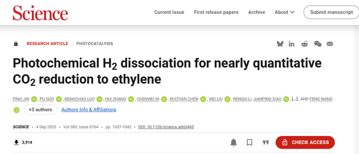
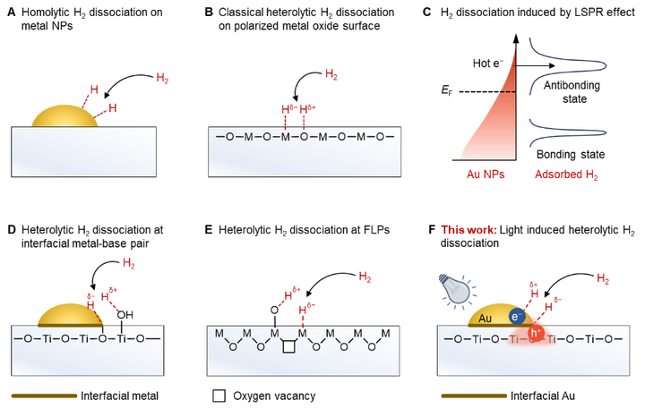
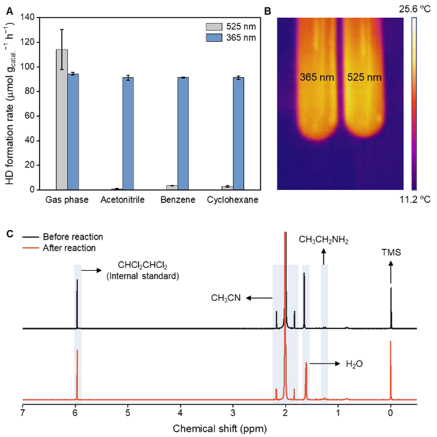
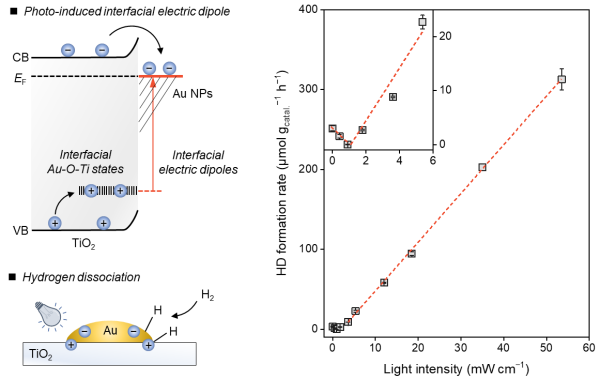
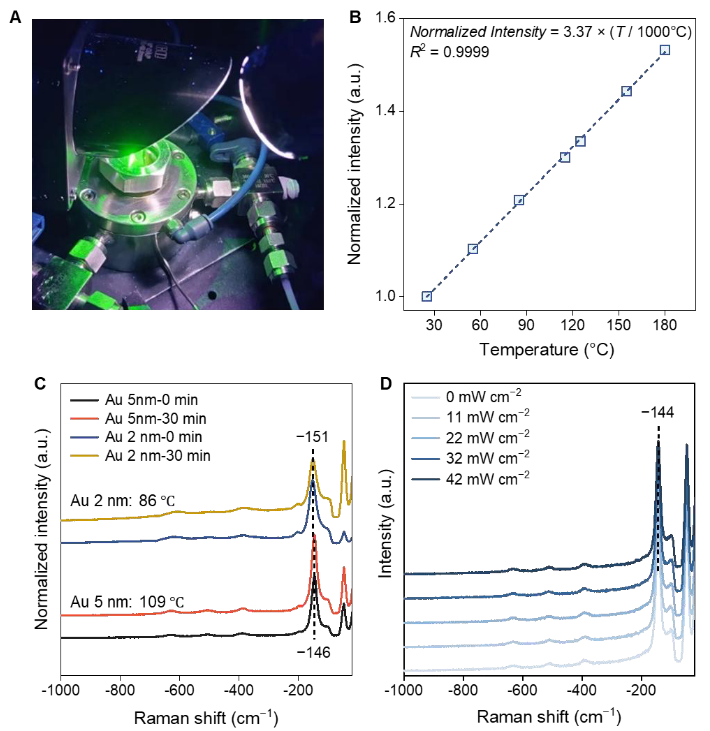
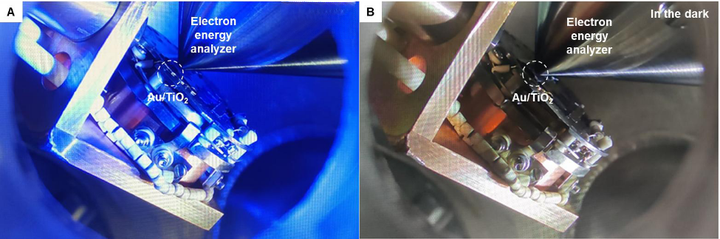
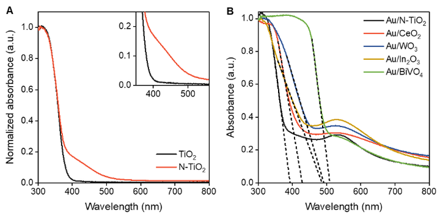

# 中科院王峰团队：用二氧化碳光催化制备乙烯

> **一句话总结**：中科院王峰团队首次实现常温下用太阳光将二氧化碳高效转化为乙烯（转化率近100%，选择性>99%），同时解决温室效应和化工原料两大难题。

## 核心观点 (Key Takeaways)

- **双难题同步解决**：温室效应（CO2积累）与乙烯制备（传统依赖石油、碳排放高）两大挑战被同时攻克
- **常温氢气异裂**：打破传统需要300-500°C高温的局限，在常温下实现氢气异裂产生极性氢物种
- **光催化全流程**：Au/TiO2催化剂在365nm紫外光下产生空间分离的电子-空穴对，形成"微观磁场"使H2异裂
- **高效C-C偶联**：通过光催化实现CO2→乙烷→乙烯的两步转化，避免传统工业800-900°C的脱氢反应
- **循环化工模式**：从线性"石油→乙烯→废弃"转向循环"CO2→乙烯→化学品→CO2"

## 关键数据与证据 (Fact Sheet)

| 指标 | 数据 |
|------|------|
| CO2转化率 | 接近100% |
| 乙烷选择性 | >99% |
| 乙烯收率 | >99% |
| 系统稳定运行时间 | >1500小时（约2个月+） |
| 传统脱氢反应温度 | 800-900°C |
| 传统氢气异裂温度 | 300-500°C |
| 全球乙烯年产量 | >1.5亿吨 |
| 每吨乙烷消耗CO2 | 约1.57吨 |
| 太阳光下乙烷选择性 | 90% |
| 光催化剂 | Au/TiO2, Au/N-TiO2, Au/CeO2, Au/BiVO4 |
| 光源波长 | 365nm紫外光（可扩展至可见光） |

## 反应路径

```
CO2 + H- → COOH-（甲酸根离子）
COOH- + H+ → HCOOH（甲酸）
2HCOOH → C2H6 + 2H2O（C-C偶联）
C2H6 → C2H4 + H2（脱氢反应）
```

## 图片















---

## 原始文本清洗版 (Original Content)

省流版：

你面前有两个难题。

第一个是大气中不断增加的二氧化碳，它很稳定，很难参与化学反应。所以温室效应不断加剧。

第二个难题是我们需要乙烯。乙烯被称为"化工之王"。你穿的衣服、用的塑料袋、轮胎，都离不开它。全球每年生产超过1.5亿吨乙烯。但传统上，我们用石油制备乙烯。这个过程消耗大量能源，产生大量碳排放，污染环境，加剧温室效应。

而中科院王峰团队的这项研究，同时解决了这两个问题。

他们用二氧化碳制备乙烯。

核心技术：氢气异裂

氢气分子在正常情况下，2个氢原子分开时各带走一个电子。

保持电荷平衡，这叫"均裂"。

但"异裂"不同。一个氢原子带走两个电子，变成负电荷。另一个没有电子，变成正电荷。

这就产生了，极性的氢物种。

为什么极性氢物种很重要？

因为它们反应活性更高，更容易和二氧化碳结合。

过去，氢气异裂需要高温（通常在300-500°C），这需要大量能量输入。

王峰团队牛x的地方在于：他们在常温下实现了氢气异裂。

让我们深入来看看这个机制。

研究团队使用金纳米颗粒负载在二氧化钛上，形成Au/TiO2催化剂。

当365纳米的紫外光照射时，光激发二氧化钛，产生电子和空穴。

电子跑到金纳米颗粒上被束缚，空穴留在Au-O-Ti界面处被捕获。

这样就形成了空间邻近的正负电荷中心，创造了一个微观的"磁场"。

氢气分子在这个"磁场"中发生异裂。

一个氢原子变成H+（质子），另一个变成H-（氢负离子）。

这个过程的巧妙之处在于：电子和空穴虽然空间邻近，但不会复合，避免了能量损失。

现在我们理解了氢气异裂，再来看看如何将二氧化碳转化为乙烷。

异裂产生的氢负离子（H-）具有强还原性，它可以攻击二氧化碳分子。

反应过程是这样的：

CO2 + H- → COOH-（甲酸根离子）

COOH- + H+ → HCOOH（甲酸）

2HCOOH → C2H6 + 2H2O（通过复杂的C-C偶联反应）

这个过程的关键是C-C偶联。

两个碳原子需要结合形成乙烷，传统上这需要高温高压。

但

在光催化条件下，反应可以在常温下进行

而且

二氧化碳单程转化率接近100%，乙烷选择性大于99%。

团队还实现了乙烷进一步转化为乙烯。

这个步骤叫脱氢反应：

C2H6 → C2H4 + H2

在传统工业中，这需要800-900°C的高温，消耗大量能量。

但

研究团队用光催化实现了这个过程，乙烯收率大于99%，系统稳定运行超过1500小时。

这意味着什么？

意味着整个过程，从二氧化碳开始，最终得到乙烯。

完全不需要石油。

上面的数据描述似乎不太能直观感受到震撼性，再来扩展一下

1、二氧化碳转化率接近100%

这意味着几乎所有进入反应器的二氧化碳都被转化，没有浪费。

2、乙烷选择性大于99%

这意味着生成的产物非常纯净，不是一堆难以分离的混合物。

3、1500小时的稳定性

相当于连续运行两个多月，这说明催化剂不会很快失活。

还有一个很牛的地方，这个技术具有普适性。

研究团队证明，光催化氢气异裂可以在多种体系中实现：

Au/N-TiO2（氮掺杂二氧化钛）

Au/CeO2（氧化铈）

Au/BiVO4（钒酸铋）

这些材料可以利用可见光，不只是紫外光。

团队还用太阳光进行了验证。

在太阳光照射下，二氧化碳制乙烷的选择性达到90%。

让我们从更大的视角理解这个发现的意义。

首先，它直接消耗二氧化碳。

每生产一吨乙烷，理论上需要消耗约1.57吨二氧化碳。

如果这个技术大规模应用，可以显著减少大气中的二氧化碳浓度。

其次，它用可再生能源驱动。

太阳光是免费的，无污染的。

更重要的是，它改变了整个化工产业的模式。

传统模式是线性的：

石油 → 乙烯 → 化学品 → 废弃

新模式是循环的：

CO2 → 乙烯 → 化学品 → CO2 → 乙烯

这种循环模式是实现碳中和的核心理念。
