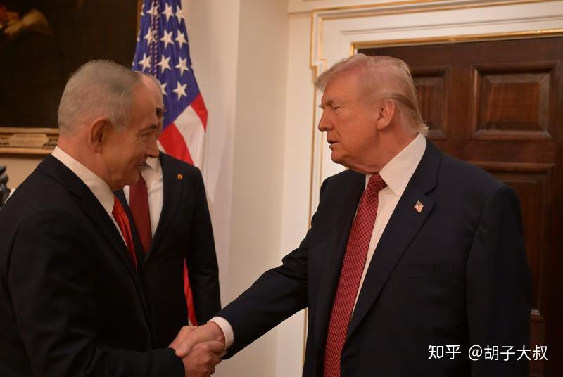
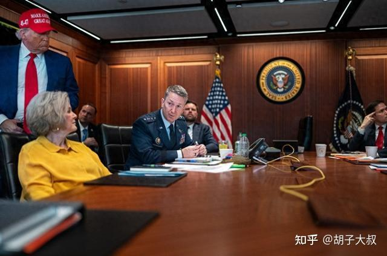
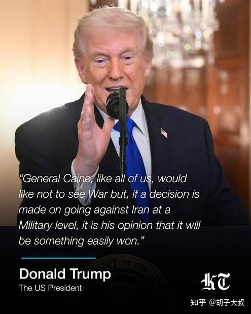
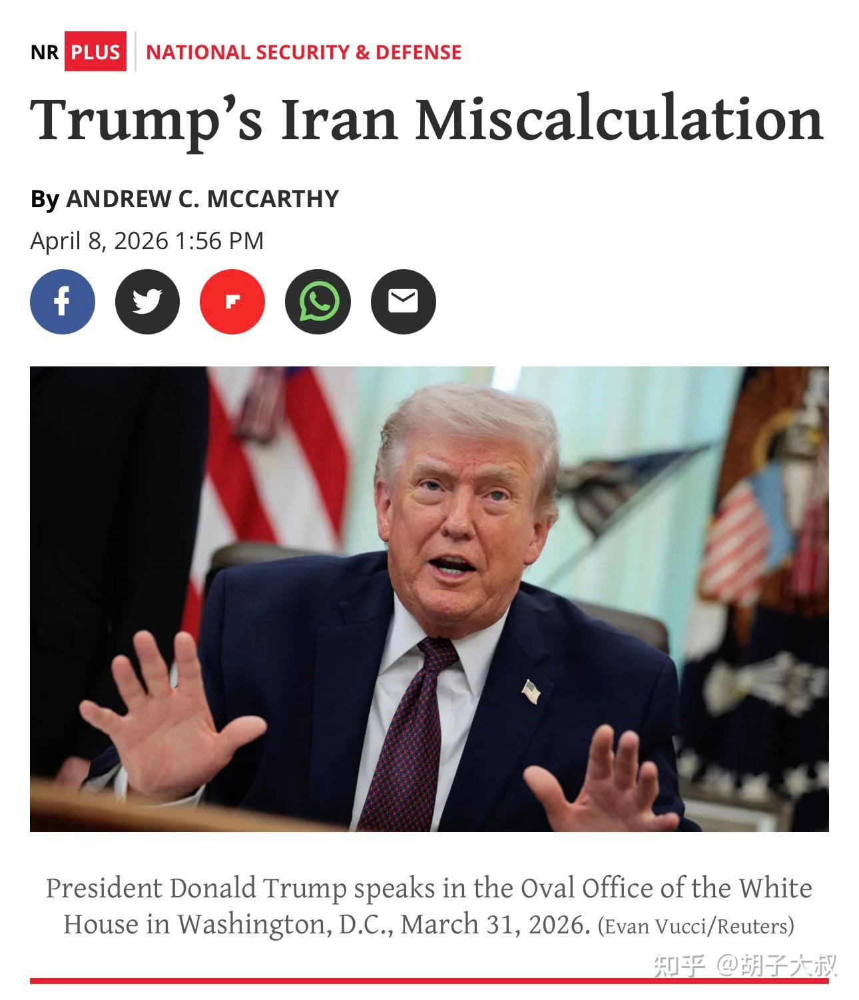
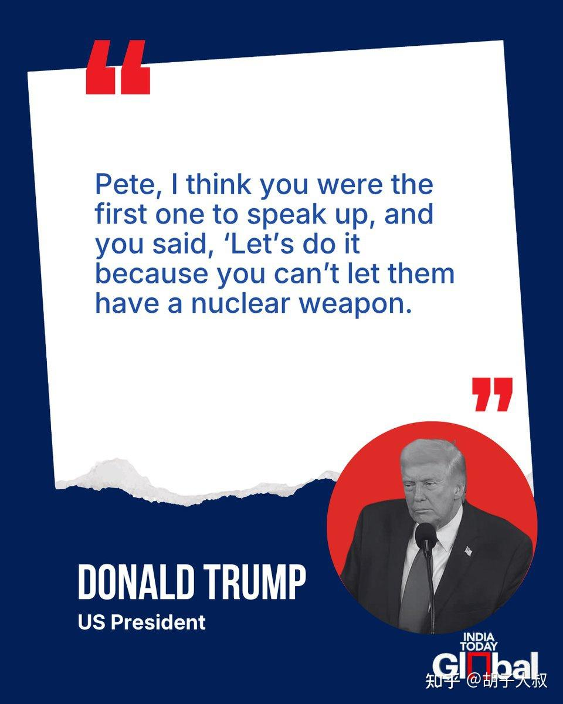
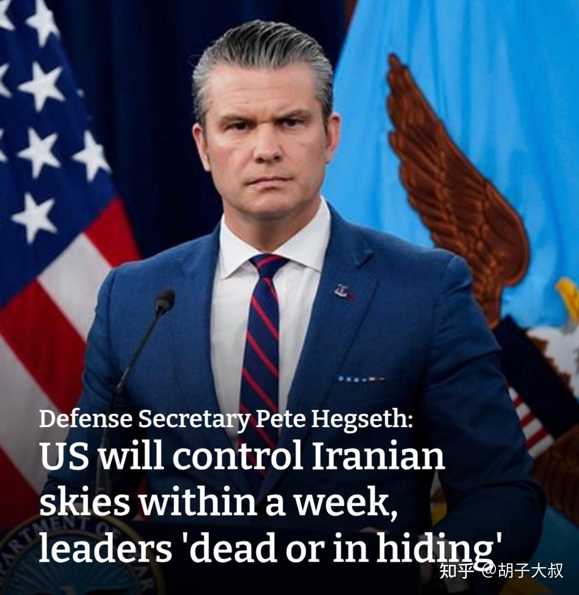
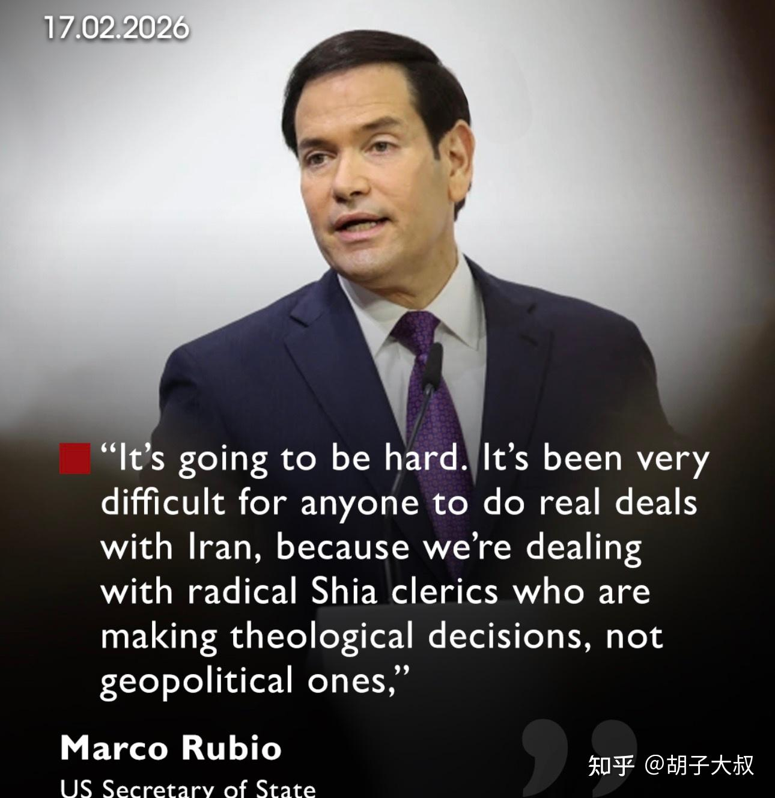

# 特朗普如何将美国拖入与伊朗的战争

> **一句话总结**：特朗普在白宫"赢学"文化和顺从氛围下，不顾多位高层顾问反对，仅凭直觉和以色列游说，在几乎无准备情况下发动对伊朗战争，导致美军遭遇越南战争以来中东最大损失，仅实现政权从"老哈梅内伊到小哈梅内伊"的无意义更迭。

## 核心观点 (Key Takeaways)

### 1. 决策起源：以色列的秘密游说
- 2026年2月11日，内塔尼亚胡秘密访问白宫战情室，通过远程视频展示"胜利蓝图"
- 描绘画面：几周内摧毁伊朗导弹、无法封锁霍尔木兹海峡、伊朗国内爆发起义、政权更迭
- 特朗普听完立即回应："我听着不错"
- **避开了明确反对开战的副总统万斯**（万斯当时正在阿塞拜疆访问）

### 2. 高层的集体反对与集体屈服
- **CIA局长拉特克利夫**：政权更迭目标"极其荒谬的意想天开"
- **国务卿卢比奥**：内塔尼亚胡的报告"简直是胡说八道"
- **副总统万斯**：从阿塞拜疆赶回后极力反对，警告油价暴涨、违背竞选承诺
- **参联会主席凯恩**：以色列"喜欢夸大其词"，提出四大风险警告
- 最终立场转变：2月26日最终会议上，万斯说"你知道我认为这是个坏主意，但如果你真的想要这么做，我支持你"；卢比奥也转而附和

### 3. "暧昧反对"酿成的战略误判
- 凯恩将军的反对风格低调务实，把自己定位为"参谋军官而非决策者"
- 特朗普有意/无意**误读**凯恩报告，对外宣称"凯恩认为这将是一场很容易获胜的事"
- 白宫"忠诚测试"文化：超过1300名国务院雇员被解雇，批评被视为禁忌
- 国防部长赫格塞思被指责"只给特朗普看空袭成功视频，隐瞒伊朗报复真实规模"

### 4. 总统直觉战胜理性
- 特朗普要求凯恩"打回重做"风险报告，潜台词："给我弄一份更加温和的版本"
- 赫格塞思以"抓捕马杜罗"成功案例类比，称伊朗行动也会"代价远比预想的小"
- 特朗普相信能以极小代价"解决困扰美国47年的头号敌人"

### 5. 灾难性的战争后果
- 2月28日发动代号"史诗狂怒"军事行动
- **人员伤亡**：至少28人死亡，468人受伤（18人重伤）
- **空中力量损失超18亿美元**：
  - F15E战斗机×4：9300万美元
  - KC135R加油机×3：2.7亿美元
  - E3G哨兵预警机×1（全球仅存16架）：超7亿美元
  - MQ-9无人机×14：4.48亿美元
  - 其他多架飞机损毁
- **防空体系被摧毁**：
  - 铺路爪战略预警雷达×1（11.2亿美元）：导致导弹探测窗口缩短60%
  - 爱国者系统×13：超70亿美元
  - 萨德反导雷达×1
  - 17座美军基地核心设施被命中
- **能源危机**：Brent原油突破126美元，霍尔木兹海峡被封锁，全球24%原油和20%天然气供应断裂
- **最终结果**："从老哈梅内伊政权更迭成了小哈梅内伊政权"

## 关键数据与证据 (Fact Sheet)

| 类别 | 数据 |
|------|------|
| **决策时间线** | 2月11日内塔尼亚胡游说 → 2月26日最终决定 → 2月28日开战 |
| **美军伤亡** | 死亡28人，受伤468人（重伤18人） |
| **空中损失金额** | F15E(9300万) + KC135R(2.7亿) + E3G(7亿+) + MQ-9(4.48亿) + 其他 ≈ **超18亿美元** |
| **防空体系损失** | 铺路爪雷达(11.2亿) + 爱国者×13(70亿+) + 萨德雷达 + 17座基地 = **超80亿美元** |
| **能源冲击** | Brent原油突破**126美元/桶** |
| **人员解雇** | 超过**1300名**国务院雇员被解雇 |
| **E3G预警机** | 全球仅存**16架**，且无法再生产 |

### 核心会议参与者（小范围闭门会议）
- 白宫幕僚长苏西·威尔斯
- 国务卿兼国家安全顾问马可·卢比奥
- 战争部长皮特·赫格塞斯
- 参谋长联席会议主席丹·凯恩将军
- CIA局长约翰·拉特克利夫
- 特朗普女婿贾里德·库什纳
- 中东特使史蒂夫·威特科夫

### 凯恩上将提出的四大开战风险
1. **赌注远高于任何类似行动**：伊朗有强大导弹能力、复杂地形和顽强抵抗意愿
2. **容易陷入长期纠缠**：可能演变为类似过去中东战争的消耗战
3. **美军人员伤亡风险显著增加**：进入全面对抗后损失将远超预期
4. **武器库存消耗严重**：支援以色列和乌克兰已使关键库存紧张，产能不足

---

## 原始文本清洗版 (Original Content)

《纽约时报》发了一篇非常详尽的文章，标题是《特朗普如何将美国拖入与伊朗的战争》，我们可以看到，在目前白宫的赢学与顺从文化下，事关国家生死存亡的关键决策竟这样如同儿戏。

### 1.秘密报告

2026年2月11日上午接近11点，一辆黑色SUV低调驶入白宫，载着以色列总理本雅明·内塔尼亚胡。此次访问刻意避开媒体视线，没有公开仪式。

美以官员先在椭圆形办公室旁的内阁会议室简短会面，随后内塔尼亚胡被带到地下白宫战情室（Situation Room）——这个高度机密的场所极少用于外国领导人的面对面会谈。

特朗普没有坐在会议桌主位，而是坐在桌子一侧，面对墙上大屏幕。内塔尼亚胡坐在他对面，正对着总统。内塔尼亚胡身后的大屏幕上，实时出现摩萨德局长戴维·巴内亚（David Barnea）和以色列军方官员的身影。营造出"战时领导人被团队簇拥"的视觉效果。

参会核心成员（小范围闭门会议）：
- 白宫幕僚长苏西·威尔斯
- 国务卿兼国家安全顾问马可·卢比奥
- 战争部长皮特·赫格塞斯
- 参谋长联席会议主席丹·凯恩将军
- CIA局长约翰·拉特克利夫
- 特朗普女婿贾里德·库什纳
- 中东特使史蒂夫·威特科夫

副总统万斯没有在场，他正在阿塞拜疆访问。玛吉·哈伯曼（Maggie Haberman）说内塔尼亚胡特意挑选这个时间点，目的就是避开万斯副总统，因为他是幕僚中与伊朗开战的明确反对者。

随后，内塔尼亚胡进行了约一小时的高强度陈述，强烈主张伊朗已政权更迭时机成熟。他认为美以联合军事行动能够快速推翻伊斯兰共和国，并描绘了近乎必然胜利的图景：
- 伊朗弹道导弹计划可在几周内被摧毁。
- 伊朗政权将被严重削弱，无法封锁霍尔木兹海峡。
- 对美国在中东利益的报复风险极低。
- 以色列情报可帮助在伊朗境内煽动街头抗议，最终实现政权更迭。

会议中，内塔尼亚胡还播放了一段视频，展示如果神权政府倒台后可能领导伊朗的新人物，包括流亡的伊朗末代沙王之子礼萨·巴列维（Reza Pahlavi）。

特朗普听完后迅速回应："我听着不错。"

国务卿卢比奥率先提出质疑，认为和伊朗开战风险太大。

内塔尼亚胡则回应："这当然存在风险，但是不采取行动的风险大于采取行动的风险。如果打击推迟，伊朗就能快速研发出核武器，到时候所有的行动都太晚了！"

### 2.针锋相对

美国分析人员连夜加班评估内塔尼亚胡提出的内容。第二天（2月12日），他们在另一次战情室会议上给出了直率的结论。

中情局局长约翰·拉特克利夫说："以色列方案中提出的前两个目标——杀死最高领袖并削弱伊朗威胁邻国的能力是可以实现的。但内塔尼亚胡及其团队提出的后两个目标——在伊朗境内引发民众起义，并用新的世俗领导人取代伊斯兰政府——则无法实现。目前没有任何的情报显示，推翻现有政权的行动，能在短时间内轻易获得成功。这是极其荒谬的意想天开。"

卢比奥补充道："（内塔尼亚胡的报告）简直是胡说八道！"

刚刚从阿塞拜疆外交访问回来的副总统万斯也参加了这个会议，他的态度非常强烈，极力地反对开火。万斯说："我知道你想这么做，但我认为这是个坏主意"

他随即长篇大论地阐述了自己的核心观点：
- 内塔尼亚胡对政权更迭的预测太过乐观和不现实
- 战争很可能引发地区大规模混乱，造成大量伤亡，并严重消耗美国武器库存
- 伊朗一旦面临政权存亡威胁，报复行动将难以预测，霍尔木兹海峡极有可能被封锁，导致油价暴涨
- 这场战争违背了特朗普"不打新战争"的竞选承诺

特朗普总统旋即转头问美国参谋长联席会议主席唐·凯恩上将："你的意见呢？"

凯恩上将回答道："依我的经验，这是以色列的惯用伎俩，他们喜欢夸大其词，但是计划又往往没有那么完美。他们知道需要我们，才这样推销自己。"

2月12日会议没有达成任何重要结论。当时主战派的战争部长皮特·赫格塞思以及金刀驸马贾里德·库什纳都因故没有在场。

凯恩上将随后向总统提交了战情报告，提出了开战面临的四大风险：
1. **行动赌注远高于之前任何类似行动**
2. **更容易陷入旷日持久的纠缠和长期冲突**
3. **美军人员伤亡风险明显增加**
4. **武器库存消耗严重，后续补给困难**

### 3. 暧昧反对

凯恩虽然提交了这份详细的军事风险报告，但他的性格和前任参谋长联席会议主席马克·米利将军完全不同。米利将军是出了名的暴脾气，如果他强烈反对某件事，就会据理力争、寸步不让。而凯恩的风格则低调务实得多，他更愿意以中立、专业的态度把行动的风险摆到桌面，但始终把自己定位成一名参谋军官，而不是决策者。

可惜的是，特朗普总统有意或无意地误读了这句话的含义，把凯恩包装成一个支持打击伊朗并确定能获得胜利的参谋长。2026年2月23日，他对媒体说：

"General Caine, like all of us, would like not to see War but, if a decision is made on going against Iran at a Military level, it is his opinion that it will be something easily won."

《外交政策》杂志4月8日的文章指出：超过1300名国务院雇员被解雇，国家安全委员会也遭到严重削弱。特朗普营造了一种对通过"纯洁性考验"的内阁官员绝对服从的氛围。批评被视为禁忌，公开奉承则受到鼓励。

最明显的例子，就是美国国防部长皮特·赫格塞思，他是对伊朗作战的绝对强硬派，被指责向特朗普展示误导性的精彩集锦，只给他看空袭成功视频，而隐瞒伊朗报复的真实规模和战争的复杂性。内部有人直言："Pete没有对总统说真话。"

### 4.总统的直觉

特朗普要求凯恩"打回重做"风险报告，潜台词很明显：给我弄一份更加温和的版本。

赫格塞思向特朗普总统拨打电话，在电话中他说："我们干吧！我们不能允许伊朗获得核武器。"

这位美国战争部长对媒体说："这是一个决定性的时刻。我们掌控天空，必须完成任务。我们将在一周内控制伊朗领空，他们的领导人要么死掉，要么躲起来！"

与此同时，随着2月17日美伊的第二轮谈判在日内瓦陷入僵局，国务卿卢比奥的态度也开始发生转变。

卢比奥在匈牙利说："（与伊朗的谈判）将会很困难。对任何人来说，与伊朗达成真正的协议一直都非常困难。"

在2024年不可思议的东山再起之后，特朗普身边的人对他命运、直觉以及他让现实屈服于自己意志的能力产生了近乎迷信的信仰。

### 5. 决策出兵

2月26日，最后一次战前会议在白宫召开。

副总统万斯第一个发言："你知道我认为这是个坏主意，但是如果你真的想要这么做，我支持你。"

国务卿卢比奥第二个发言："虽然我认为这存在一定的风险，但是总统您认为这是为了美国国家安全必须采取的行动的话，那就应该去做。"

中情局局长拉特克里夫第三个发言："我们需要明确定义何为颠覆伊朗现政权。如果是杀了现任这批伊朗官员的话，我认为是可行的。"

白宫高级法律顾问沃灵顿第四个发言："是的，如果以色列这么做了，那我们也应当如此"

国防部长皮特·赫格塞思第六个发言："早晚都会和伊朗开战的，现在是最佳时机。这个政权刚刚杀了四万人。"

美国参谋联席会议主席丹·凯恩上将第七个发言，他阐述了此次行动的风险以及其对伊朗军备消耗的影响和风险，没有发表意见。

特朗普总统做了最后的总结："我们必须这样做。我们必须确保伊朗没有核武器，也必须确保伊朗不能向以色列发射导弹。"

针对伊朗的开战计划得到通过。

### 6. 战略误判

2月28日，在几乎没有完成任何准备的情况下，美军发动代号"史诗狂怒"的军事行动，美伊战争正式爆发。

截至4月9日，美国至少28人死亡，468人受伤，其中18人重伤。

空中力量方面：
- 四架F15E战斗机损毁，累计损失9300万美元。
- 三架KC135R空中加油机损毁，累计损失2.7亿美元。
- 一架E3G哨兵预警机损毁，系美军在中东雷达的预警中枢，全球仅存16架且无法再生产，损失超7亿美元。
- 14架MQ-9死神察打一体无人机损毁，累计损失4.48亿美元。
- 其他多架飞机损毁

在防空反导体系方面：
- 一套位于卡塔尔乌代德空军基地的铺路爪战略预警雷达，造价11.2亿美元。探测距离达5000km，其损毁直接导致美军在中东的导弹探测预警窗口缩短60%。
- 十三套爱国者防空系统的雷达车与发射车损毁或不可逆重伤，损失超70亿美元。
- 一套部署于阿联酋的萨德反导系统核心雷达完全损毁。
- 十七座中东美军基地的核心设施被直接命中。

霍尔木兹海峡遭到封锁，油价暴涨，Brent原油价格一度突破126美元。全球24%的原油和20%的天然气供应断裂，全球陷入能源危机。

美军遭受了战术硬损失、体系能力损伤、战略信誉崩塌的三重打击，遭受了越南战争以来美军在中东的最大军事损失。

**与此同时，美军亦完成了伊朗政权的更迭———从老哈梅内伊政权更迭成了小哈梅内伊政权。**

### 参考文献

- How Trump Took the U.S. to War With Iran, The New York Times (April 7, 2026)
- 6 Takeaways From the Story of Trump's Decision to Go to War With Iran, The New York Times (April 7, 2026)
- How Trump and His Advisers Miscalculated Iran's Response to War, The New York Times (March 10, 2026)
- Iran War Cease-Fire: Why Trump Mishandled Tehran, Foreign Policy (April 8, 2026)
- Did Trump Miscalculate on Iran?, Foreign Policy (March 2, 2026)
- Trump Is Losing the War in Iran, Foreign Policy (March 30, 2026)
- Trump's Confusing Iran War Objectives, Foreign Policy (March 5, 2026)
- Trump's Recipe for Accelerated U.S. Decline, Foreign Policy (April 9, 2026)
- 2025–2026 Iran–United States Negotiations, Wikipedia
- Regime Change: Inside the Imperial Presidency of Donald Trump
