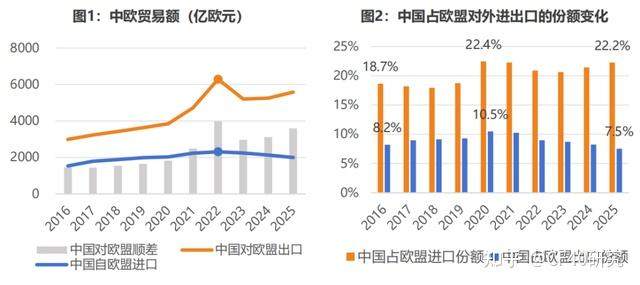
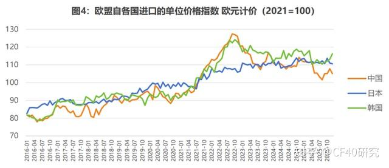
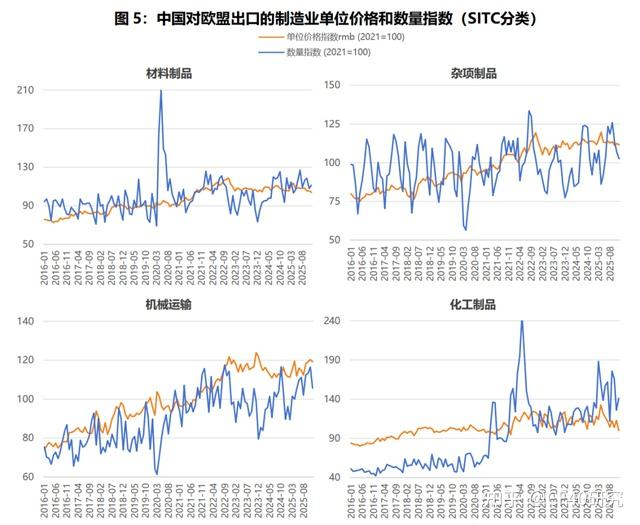
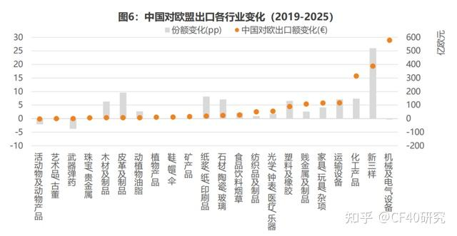
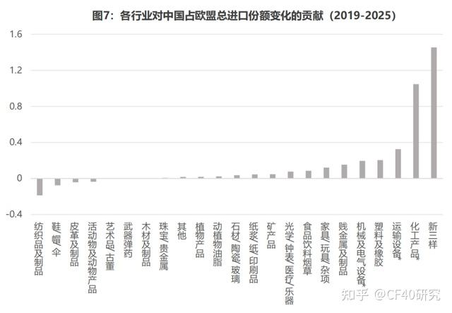
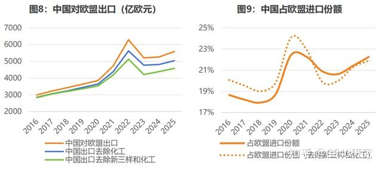
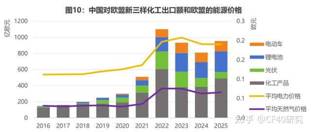
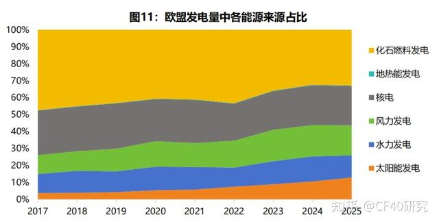

# 中欧贸易失衡扩大的结构性根源：能源转型、产能升级与国产替代

> **一句话总结**：中欧贸易逆差扩大并非中国产能过剩或低价倾销所致，而是欧盟能源转型与能源危机推升需求，叠加中国产业升级加速国产替代共同作用的结构性结果。

## 核心观点 (Key Takeaways)

- 欧盟对华逆差从2019年的1650亿欧元扩大至2025年的3593亿欧元，但增长高度集中于"新三样"（电动汽车、锂电池、光伏）和化工产品，两类合计贡献约七成的中国对欧出口份额增幅。
- 量价数据不支持"低价倾销"叙事：中日韩三国对欧出口欧元价格指数走势高度接近，中国出口扩张发生在人民币相对走强而非走弱阶段；传统制造业（杂项制品、材料制品）对欧出口数量并未持续扩张。
- 中国对欧出口增长的两大驱动力来自欧盟内部：一是能源危机抬高欧洲化工等行业生产成本，推动进口替代；二是绿色转型拉动新能源产品需求。
- 欧盟对华出口走弱的主因并非中国内需萎缩，而是中国产业升级加速、国产替代导致进口依赖系统性下降。
- 欧盟整体对外仍维持贸易和经常账户顺差，中欧逆差扩大是双边结构性失衡，而非欧盟对外顺差整体恶化。

## 关键数据与证据 (Fact Sheet)

### 逆差规模变化
- 2025年欧盟对华货物贸易逆差：**3593亿欧元**（较2024年3122亿欧元增长15%），是2019年1650亿欧元的**两倍以上**
- 2016–2019年欧盟对华逆差基本稳定在**1600亿欧元**左右，2020年起持续快速扩大
- 逆差扩大由进口和出口两端同时驱动

### 中国对欧出口端
- 中国对欧出口2022年跃升至**6289亿欧元**历史高位；2025年增至**5588亿欧元**，较2019年累计增长约**54%**
- 中国占欧盟域外进口比重：从2019年**18.7%**升至2025年**22.2%**
- **"新三样"**和**化工产品**合计贡献约**950亿欧元**出口增量，占总份额增幅**七成**（2.5/3.52个百分点）
- "新三样"在欧盟进口份额增长约**26个百分点**
- 机械及电气设备份额反而下降**0.3个百分点**（2019–2025年），出口额虽增580亿欧元但未转化为市场份额

### 欧盟对华出口端
- 欧盟对华出口2022年达**2310亿欧元**峰值后连续三年下降
- 2025年降至**1995亿欧元**，较峰值累计减少**14%**
- 欧盟对华出口占其全球出口比重：从2020年**10.5%**降至2025年**7.5%**
- 欧盟在中国总出口中的占比：从2019年**17.2%**降至2025年**14.8%**（中国出口目的地多元化）

### 能源与产业数据
- 2025年欧盟非居民电力价格：**0.19欧元/千瓦时**，较2021年0.13欧元上涨近**50%**
- 欧盟约**40%**进口天然气此前来自俄罗斯
- 风电和太阳能发电占欧盟发电比重：2025年达**31%**；清洁能源发电占比约**三分之二**

---

## 原始文本清洗版 (Original Content)

近年来中欧贸易失衡的持续扩大，已经成为中欧经贸关系的关注焦点之一。主流观点通常将其归因于中国产能过剩带来的外溢压力、中美贸易摩擦引发的贸易转移、人民币汇率偏弱带来的价格优势，以及中国内需疲软导致欧盟对华出口降低。本文基于行业数据分析发现，这些解释与数据所呈现的事实不符。

在欧盟进口端，中国对欧出口的增长并非全面扩张，而是高度集中于"新三样"和化工产品；量价数据也不支持中国商品低价倾销的判断。"新三样"和化工产品的出口增长更大程度上反映了欧盟自身的结构性变化：一方面，绿色转型带动了对新能源产品的需求；另一方面，能源危机抬升了欧洲化工等行业的生产成本，增强了对外部供给的依赖。

在欧盟出口端，欧盟对华出口集中行业对应的中国内需在2021-2024年间均保持扩张。欧盟对华出口走弱的主因不是中国市场整体萎缩，而是中国进口依赖下降背景下的国产替代加快。

因此，欧盟对华逆差的扩大，本质上是中国制造业升级与欧洲能源约束共同作用的结果。单纯依赖关税等贸易保护工具难以改变其结构性根源。

* 本文作者系中国金融四十人研究院王健坤、郭凯。本文版权归中国金融四十人研究院所有，未经书面许可，禁止任何形式的转载、复制或引用。

### 中欧逆差为何在近五年突然扩大

2025年，欧盟对华货物贸易逆差扩大至3593亿欧元，较2024年的3122亿欧元逆差增长了近15%，是2019年1650亿欧元逆差的两倍以上。

实际上，逆差快速扩大主要是近年的现象，而非过去十年持续存在的长期趋势。2016年至2019年间，欧盟对华逆差基本稳定在1600亿欧元左右（图1）。真正改变格局的是2020年以来逆差的持续快速扩大，且这一轮扩大由进口和出口两端同时驱动。这使得中欧贸易失衡成为中欧经贸关系的关注焦点之一。

数据来源：Eurostat，CF40研究院

从中国出口端看，中国对欧出口在2020年疫情后明显上行，2022年在俄乌冲突背景下大幅跃升至6289亿欧元的历史高位（图1）。2023年短暂回落至5205亿欧元，但并未改变整体上升趋势，2024年中国对欧出口回升至5257亿欧元。2025年进一步增至5588亿欧元，同比增长约6%，较2019年累计增长约54%。

从中国进口端看，欧盟对华出口则持续走弱：欧盟对华出口在2022年达到2310亿欧元峰值后连续三年下降。2025年欧盟对华出口额降至1995亿欧元，较2024年的2135亿欧元同比减少7%，较2022年峰值累计减少14%，且降幅逐年扩大。

这种"一升一降"的格局在份额上体现得更为清晰（图2）。中国占欧盟域外进口的比重从2019年的18.7%升至2025年的22.2%，中国在欧盟进口来源中的地位持续上升。与此同时，欧盟对华出口占其全球出口的比重从2020年的10.5%降至2025年的7.5%，中国市场对欧盟出口商的重要性在下降。

值得注意的是，从中国自身的出口结构看，欧盟在中国总出口中的占比也从2019年的17.2%降至2025年的14.8%，说明中国出口目的地日益多元化，对欧盟市场的出口依赖程度也是在下降的。

出口和进口不断扩大的剪刀差表明，中欧贸易失衡已不再是短期波动，而是具有越来越明显的结构性特征。

图3显示，欧盟对外整体维持贸易和经常账户顺差，2022年受能源危机冲击一度转弱，但此后较快恢复并回升至高位，欧盟对外整体的贸易和经常账户并未同步恶化。

这说明，近年来欧盟与中国之间逆差的扩大，是双边贸易关系中的特定失衡，并不是欧盟对外顺差的整体恶化。因此，要理解逆差为何扩大，还是需要回到中欧双边贸易本身，观察各自发生了什么。

数据来源：Eurostat，CF40研究院

围绕中欧贸易失衡变化，当前欧洲政策讨论中最为常见的解释有四种：

第一种解释认为中国产业政策催生了大规模产能扩张，过剩产能以低价涌入包括欧盟在内的海外市场。

第二种解释认为中美贸易摩擦升级后，原本面向美国的商品被迫转向欧盟，构成了一种低价倾销。

第三种解释认为人民币汇率持续偏弱，为中国制造业出口提供了系统性的价格优势。

第四种解释侧重中国的需求侧：2021年以来中国房地产持续下行，国内需求整体疲弱，中国对进口商品的吸纳能力系统性下降，直接压缩了欧盟对华出口的空间。

然而，本文发现行业和贸易数据不支持上述解释。事实上，中国对欧出口并未出现全面扩张，也不是以低价竞争为主要特征，近年的出口增长集中在少数产业；欧盟对华出口的走弱，则更多源于中国进口依赖下降和国产替代加快，而非中国市场整体萎缩。

本文认为，中欧贸易失衡扩大的背后，是欧盟需求结构变化与中国供给结构变化的共同作用。一方面，欧盟能源转型推高了产业成本，并增加了对中国"新三样"和化工产品的进口需求；另一方面，中国产业升级加速了国产替代，降低了对进口产品的需求，压缩了欧盟商品对华出口空间。但双边的贸易失衡并未改变欧洲整体对外顺差的格局，欧洲在对华逆差增大的同时，对其它贸易伙伴的顺差也在同步增长。

### 中国出口端：欧盟能源转型拉动而非低价倾销

#### 1. 量价数据不支持"低价倾销"叙事

从2016-2025年的中国对欧盟出口的整体走势看，价格数据并不支持"汇率导致的低价倾销"这一说法。本节以中日韩三国为参照，因为三国对欧出口均以机械电子、化工、运输设备为主，出口欧盟的产品结构接近。以欧盟买家实际支付的欧元价格衡量，中日韩三国的出口价格指数均在2023年后110-120区间横盘运行，走势高度接近（图4）。

数据来源：Eurostat，CF40研究院

走势接近的原因在于同期日元和韩元大幅贬值，以欧元计价后，日韩国内通胀的影响被汇率贬值抵消，三国商品对欧盟买家而言的价格走势因此趋于一致。与此同时，人民币对欧元的名义汇率在2019到2022年间整体走强，直到2025年才明显走弱。

也就是说，中国对欧出口扩张其实发生在人民币相对走强而非走弱的阶段。尽管2025年以来，中国商品的欧元价格指数因为汇率变化出现了一定程度的下行，与日韩价差有所扩大，但这更像是近期变化，而非2020年以来持续推动份额上升的长期主因。

从2016-2024年的走势看，中国并未呈现出持续扩大的价格优势。如果汇率是出口的主要驱动力，中国产品的欧元价格应当在2020年起就相对日韩出现明显偏离，但数据显示三者变化大体同步。这说明中国没有因为汇率获得价格优势，汇率解释在价格层面缺少支撑。事实上，中国对欧盟出口跳升的2022年，中国商品价格的涨幅要远高于日本，也强于韩国。

数量数据同样不支持"低价抢市场"的判断。如果价格优势是中国对欧盟出口扩张的主要驱动力，那么过去五年中国制造业的出口数量应当随着价格走弱明显抬升，但是图5显示的制造业的出口数量指数和单位价格指数并不支持这一判断。

数据来源：Eurostat，CF40研究院

杂项制品和材料制品的表现最具说服力。杂项制品涵盖服装、鞋类、家具、玩具等典型消费品，是外界最容易与"中国低价制造"联系起来的板块；材料制品则覆盖钢铁、有色金属、橡塑等传统工业品，是中国制造业出口的另一大基本盘。如果低价竞争是推动对欧出口扩张的普遍机制，那么这两个行业最有可能出现持续的放量增长。

但从图5看，除2020年疫情期间的短暂波动外，2016至2025年间，这两个行业的对欧出口数量指数始终在相对窄幅区间内波动，并未出现持续上升的趋势。这说明在最接近日常消费品、最容易被视为"低价冲击"的板块，都没有发生明显的数量扩张。

相比之下，机械运输和化工是真正出现较明显出口数量扩张的行业。机械运输设备和化工制品的出口数量指数在2021年后整体上行，但其单位价格指数并没有随着出口增加而明显下滑，反而同样处在上升区间。也就是说，中国对欧盟在这两个领域的出口增长，并不是通过持续降价来推动放量，而是在价格仍有支撑的情况下实现了数量扩张。

这意味着，中国对欧盟在这两个领域的出口增长，难以用价格优势来解释，而更像是欧盟内部需求和中国供给结构发生变化的结果。

#### 2. 七成份额增幅来自"新三样"和化工

在量价分析的基础上进一步聚焦行业出口变化，可以更清楚地看到这种扩张的分布并不均匀。

图6显示，2019至2025年间，中国在欧盟21个HS章类和"新三样"行业中的进口份额变化差异很大：只有8个行业的份额上升超过5个百分点，分别是"新三样"、化工产品、运输设备、塑料及橡胶、石材陶瓷玻璃、纸浆印刷品、皮革制品、木材制品；其中"新三样"最为突出，对应欧盟进口份额增长了约26个百分点。其余14个行业变化有限，甚至有所下降。

这说明，中国在欧盟市场中的份额增长远不是各行业同步加速的全面扩张，而是集中在部分产业。

数据来源：Eurostat，CF40研究院

从结构上看，份额上升较快的行业呈现出较强的产业集中性。8个渗透速度较快的行业中，有5个属于欧盟定义下的高耗能行业（Energy-intensive Industries），包括纸浆/纸及印刷品、化工、石材陶瓷玻璃和塑料橡胶等。

再加上"新三样"及其相关的汽车配件链条，可以看出，近年来中国在欧盟市场中渗透速度较快的板块，主要集中在两类行业：一类是新能源相关产品，另一类是化工及部分高能耗产业。这种分布并不是随机的，而是呈现出明显的产业特征。

与此同时，也有一些行业的表现与刻板印象并不一致。机械及电气设备是中国对欧出口体量最大的板块，但2019年至2025年间，中国在欧盟该行业进口中的份额并未继续上升，反而降低了0.3个百分点。六年间出口额虽增加了近580亿欧元，但主要被欧盟市场整体扩容所吸收，并未转化为额外的市场份额。纺织品虽有微幅上升，但涨幅远不及高耗能行业，也未出现趋势性的持续抬升。

尤其值得注意的是，这些行业恰恰是最容易被纳入"中美贸易摩擦后中国商品转向欧洲"叙事的板块。美国自2018年起分四轮对中国商品加征301关税，覆盖范围极广，从工业机械、半导体到服装鞋类几乎无所不包。如果贸易转移是近年来中国对欧出口扩张的主要驱动力，那么在如此广泛的关税覆盖下，各行业理应更均匀地向欧盟市场加速出口。但欧盟市场并未出现相应的份额持续上升。这至少说明，将近年来中欧贸易变化简单概括为中美贸易战导致的普遍贸易转移，不符合行业层面的事实。

还有一些行业虽然行业内部份额上升较快，但其对总出口增长和逆差扩大的贡献相当有限。皮革和木材就是如此。两者的行业内部份额分别上升了9.6和6.3个百分点，但出口增量都只有约7亿欧元。且它们的份额变化更多体现为欧盟该行业总进口收缩背景下，中国相对其他供应国的份额抬升，而不是中国出口本身的大幅增长。换言之，行业内部份额上升，并不等于其在总量上同样重要。

因此，仅看各行业内部份额的升降，还不足以判断哪些板块真正推动了欧盟整体自华进口份额的上升。如果把视角从行业内部份额变化重新转回欧盟整体自华进口份额的变化，推动总量上升的力量就显得更加集中。

2019年至2025年间，中国占欧盟域外进口的份额从18.73%上升至22.25%，增加了3.52个百分点。其中，"新三样"贡献了1.45个百分点，化工产品贡献了1.05个百分点，两者合计达到2.5个百分点，占总份额增幅的七成（图7）。其余20个行业合计仅贡献约1个百分点，分散在运输设备、塑料橡胶、机械电气和贱金属等板块，单个行业贡献均不超过0.35个百分点，且部分还被纺织、鞋帽等行业的份额下降所抵消。

数据来源：Eurostat，CF40研究院

从出口绝对量来看，"新三样"和化工的主导地位同样清晰。图8中三条曲线分别代表中国对欧出口总额、剔除化工后的出口额、以及同时剔除"新三样"和化工后的出口额。三条线在2019年前几乎重合，此后逐渐分叉。到2025年，"新三样"和化工合计贡献了约950亿欧元的出口增量；剔除二者后，中国对欧出口的增幅大体延续了2019年前的趋势，并未出现明显加速。

从份额角度看，这种集中性体现得更为直观（图9）。实线（全口径）从约19%升至22%，增长超过3.5个百分点；而虚线（去除"新三样"和化工）同期仅从约20%升至22%，增幅不到一半。这说明，如果剔除"新三样"和化工，中国占欧盟进口份额仅温和上涨，其余行业的份额增长并未出现明显加速。

数据来源：Eurostat，CF40研究院

#### 3. 欧盟能源转型和本土产能收缩才是驱动力

中国"新三样"和化工行业的出口增长有一个共同的背景：欧盟能源格局的剧变。2021年下半年以来，欧洲能源格局发生剧烈变化，既推高了本土生产成本，也重塑了欧盟对外部商品的需求结构。

图10直观地呈现了这种联动关系：2021年下半年起，欧盟电力和天然气价格快速攀升，与此同时，中国对欧"新三样"和化工出口也明显增长；2022年能源危机达到高点后，两类产品的出口额均出现明显跳升。这说明近年来中国对欧出口增长，并不是孤立发生的贸易现象，而是与欧洲能源危机和绿色转型这些宏观原因密不可分。

数据来源：Eurostat，CF40研究院

这种联动主要通过两条路径传导。

**第一条路径是成本替代。** 能源危机不仅改变了欧盟的需求结构，也显著抬升了欧洲本土工业，尤其是化工行业的生产成本。2025年欧盟非居民电力价格达到0.19欧元/千瓦时，较2021年的0.13欧元上涨近50%。对于高度依赖天然气和电力的化工行业而言，这种成本冲击是直接且剧烈的。许多化工产品在欧洲本地生产的经济性明显下降，企业因此更倾向于减产、停产，并转向外部采购。

中国化工产品对欧出口的增长，更应理解为欧洲本土供给收缩后形成的进口替代。图10中化工出口与能源价格在2021–2025年间的同步上升，与这一解释一致。

**第二条路径是能源转型需求拉动。** 俄乌冲突爆发后，欧盟大幅削减对俄罗斯能源的进口。此前，欧盟约40%的进口天然气来自俄罗斯。在这一背景下，降低对外部化石能源依赖、加快能源自主和绿色转型，迅速成为欧盟政策重点。由此带来的直接结果，是欧盟对光伏、蓄电池和电动汽车等产品的需求明显上升。

中国作为全球最大的光伏、电池和电动车生产国，拥有最完整的供应链体系和最强的规模化制造能力，自然成为这一新增需求的主要供应来源。"新三样"出口的扩张，主要不是价格竞争的结果，而是欧盟能源转型需求快速释放后，中国升级后的产业供给能力恰好与之对接。

数据来源：Eurostat，CF40研究院

图11进一步说明了，这种需求变化并非短期应急，而是欧盟长期能源转型路径的一部分。2017年以来，风电和太阳能发电在欧盟发电中的占比持续上升，到2025年已达到31%；清洁能源发电占比也已提高到约三分之二。欧盟对新能源设备和相关产业链产品的需求具有明确的政策延续性和结构性基础。正因如此，2023年以后即便欧洲能源价格较危机高点有所回落，"新三样"出口仍保持在较高水平。

事实上，中国企业已在成本、产能组织和供应链完整性方面形成较强优势。欧洲对电动车、电池和光伏相关产品的进口增加，并不只是因为价格便宜，更是因为这些产品在性能、交付能力和规模化供给方面具备了现实竞争力。

换句话说，补贴可能影响了部分行业的发展速度，但它无法单独解释为什么即使在关税上升、审查趋严的情况下，欧盟仍然持续大量进口这些产品。真正主导的原因是，中国企业已经在这些产业中形成了经过市场检验的性价比优势，而欧盟自身又在能源转型过程中产生了真实而持续的需求。

### 中国进口端：国产替代加速而非内需不足

第二节讨论了中国对欧出口为何增长，本节讨论欧盟对华出口为何走弱。

分解结果显示，在欧盟对华出口集中的行业中，对应的中国表观消费整体仍在扩张。欧盟对华出口下降的核心原因不是中国市场萎缩，而是中国的产业升级和国产替代加速使得中国市场对欧盟进口产品的依赖程度在系统性地下降。

（本文为付费内容节选，剩余部分需下载CF40 APP查看）
