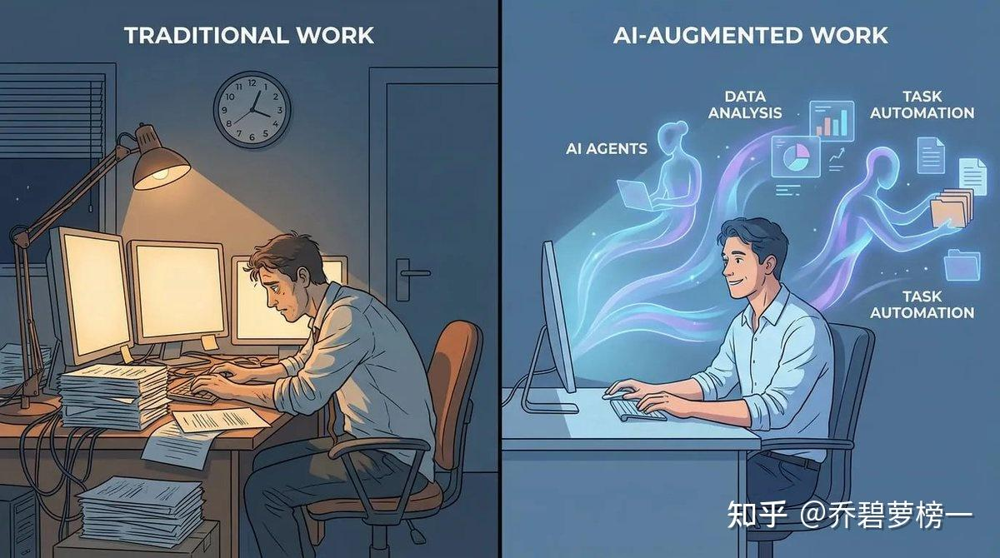
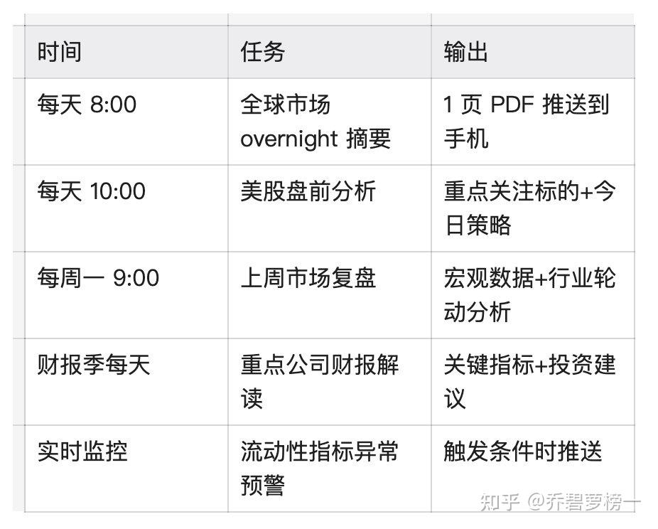
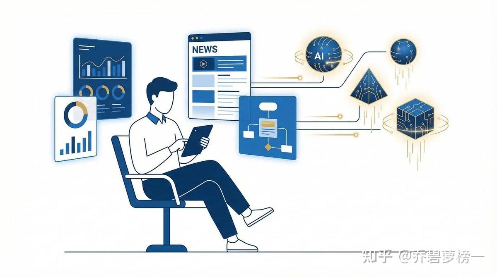
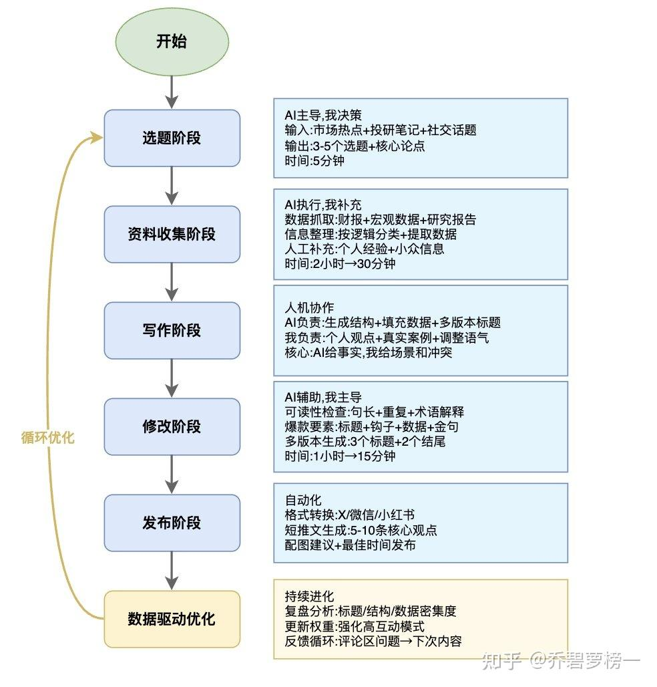
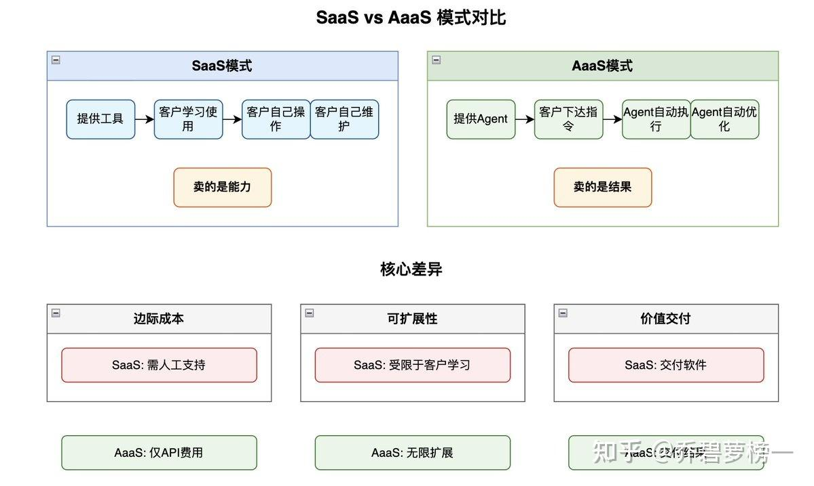
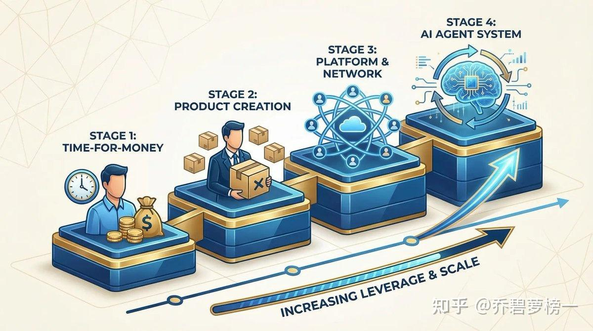

# 2026 年个人业务 Agent 化改造实战指南

> **一句话总结**：本文详细拆解了作者如何通过建立知识库、决策框架和自动化任务，将个人业务流程 Agent 化，实现工作减量 66% 且产出提升 3 倍的实战经验。

## 核心观点 (Key Takeaways)
- **思维转变**：从“我如何完成工作”转变为“我该建立怎样的 Agent 来完成工作”，利用算法杠杆替代时间杠杆。
- **三层架构**：
    1. **知识库 (Knowledge Base)**：Agent 的记忆系统，包含历史数据、实时指标和个人经验复盘。
    2. **Skills (决策框架)**：将个人判断标准显性化、结构化，让 AI 模拟人类的逻辑进行过滤和分析。
    3. **CRON (自动化执行)**：通过定时任务驱动系统运转，实现早晨 30 分钟完成全天投研决策。
- **内容生产线化**：通过爬取爆款案例提炼公式，建立“选题-资料-写作-修改-发布”的人机协作流水线。
- **范式转移**：未来将从 SaaS (Software as a Service) 转向 AaaS (Agent as a Service)，用户不再购买工具，而是购买 Agent 交付的“结果”。

## 关键数据与证据 (Fact Sheet)
- **效率提升**：每日常规工作时间从 **6 小时降至 2 小时**，业务产出提升 **300%**。
- **成本对比**：投研 Agent 每日处理 **20,000+** 条全球财经新闻、**50+** 家财报，成本仅为每月 **500 美金** API 费，效能等同于 **5 人** 团队。
- **实战战果**：Agent 系统在 2026 年 2 月市场暴跌前 48 小时发出预警，帮助作者避免了至少 **30%** 的回撤。
- **内容复利**：发现数据密集型文章收藏率比纯观点高 **40%**；通过复盘将平均收藏率从 **8%** 提升至 **12%**。
- **可复制性**：用 **2 周** 时间帮管理 **5 亿** 规模基金的经理完成了 Agent 化改造，显著提升了决策稳定性。

---

## 原始文本清洗版 (Original Content)

2026 年春节，我做了一个决定：把自己的全部业务流程 Agent 化。

一周后的今天，这套系统已经跑通了接近 1/3，尽管这套系统还在完善，我每天的常规工作任务已经可以从 6 小时降到 2 小时，但业务产出反而提升了 300%。

更重要的是，我验证了一个假设：个人业务的 Agent 化改造是可行的，而且每个人都应该打造这样一套操作系统。

拥有一个 Agent 系统，意味着你的思维彻底转变，从“我如何完成这项工作”到“我该建立怎样的 Agent 来完成这项工作”，这种从被动到主动的思维模式产生的影响是巨大的。

这篇文章，我不会输出任何 AI 生成的鸡汤，也不会刻意制造 AI 替代的焦虑，而是彻底拆解我是如何一步步完成这个转型的，以及你可以如何免费复制这套方法。

这是构建 agent 生产力系统的第一篇，现在点击收藏，追踪后续更新不迷路。

为什么 Agent 化是必选项，不是可选项

先说一个残酷的事实：

如果你的业务模式是“时间换收入”，那么你的收入天花板已经被物理定律锁死了。一天只有 24 小时，就算你全年无休，按小时计费的上限也就在那里。

- 基金经理年薪 ¥150 万 ≈ 每小时 ¥720（按 2080 工作小时算）
- 咨询合伙人年薪 ¥200 万 ≈ 每小时 ¥960
- 头部财经 KOL 年入 ¥300 万 ≈ 每小时 ¥1440

看起来很高？但这已经是人力模式的极限了。

而 Agent 化的逻辑完全不同：你的收入不再由工作时间决定，而是由系统的运行效率决定。

一个真实的转折点

2026 年 1 月的某个周五晚上 11 点，我还在电脑前整理当天的市场数据。

那天美股大跌，我需要：
- 看完 50+条重要新闻
- 分析 10 家重点公司的盘后表现
- 更新我的投资组合策略
- 写一篇市场解读文章

我算了一下，至少还要 3 个小时。而第二天早上 8 点，我又要重复同样的流程。

那一刻我突然意识到：我的时间没有花在投资分析的思考和决策，我只是在做一个数据搬运工。

真正需要我判断的决策，可能只占 20% 的时间。剩下 80% 都是重复性的信息收集和整理。

这就是我决定 Agent 化的起点。

我的投研 Agent 系统现在每天自动处理：
- 20000+条全球财经新闻
- 50+家公司的财报更新
- 30+个宏观数据指标
- 10+个行业研究报告

如果用人力完成 these 工作，需要一个 5 人团队。而我的成本是：每月 API 调用费 500 美金 + 我每天 1 小时的 review 时间。

这就是 Agent 化的本质：用算法复制你的判断框架，用 API 成本替代人力成本。

01 解构你的业务：从人到系统的三层架构

任何知识工作都可以被拆解为三层：

第一层：知识库（Knowledge Base）

这是 Agent 的“记忆系统”。

以投研工作为例，我的做法是建立了一个包含我投资所需要的信息和数据的知识库，包含：

1. 历史数据库
- 过去 10 年s的宏观经济数据（美联储、CPI、非农）
- 美股 Top 50 公司的财报数据
- 重大市场事件的复盘笔记（2008 金融危机、2020 疫情、2022 加息周期）

2. 重要指标与新闻
- 我关注的主要财经媒体和信息渠道
- 美联储政策及重点公司发布财报日期
- 我关注的 50 个 Twitter 账号（宏观分析师、基金经理）
- 重要宏观指标
- 重要的行业研究和行业数据跟踪

3. 个人经验库
- 我过去 5 年的投资决策记录
- 每次判断对错的复盘

一个具体的案例：2026 年 2 月初的市场暴跌

2 月初市场突然暴跌，黄金白银崩盘，加密货币泄洪，美股港股大 A 接连跳水。

市场上的解读主要有几个：
- Anthropic 的法律 AI 太厉害，软件股票崩盘
- 谷歌资本开支指引过高
- 即将上任的美联储主席 Warsh 是鹰派

我的 Agent 系统在暴跌前 48 小时就发出了预警，因为它监控到：
- 日债收益率跳涨，US2Y-JP2Y 利差大幅收窄
- TGA 账户余额高企，财政部持续从市场抽水
- CME 连续 6 次提高金银期货保证金

这些都是流动性收紧的明确信号。而我的知识库里，有 2022 年 8 月日元套利交易平仓引发市场波动的完整复盘。

Agent 系统自动匹配了历史模式，在暴跌前给出了“流动性紧张+估值高企→减仓”的建议。

这次预警帮我避免了至少 30% 的回撤。

这个知识库有超过 50 万条结构化数据，每天自动更新 200+条。如果用人工维护，需要 2 个全职研究员。

第二层：Skills（决策框架）

这是最容易被忽视，但最关键的一层。

大部分人用 AI 的方式是：打开 ChatGPT → 输入问题 → 得到答案。这种方式的问题是，AI 不知道你的判断标准是什么。

我的做法是把自己的决策逻辑，拆解成独立的 Skills。以投资决策为例：

Skill 1: 美股价值投资框架
（以下 Skill 为举例，不代表我实际的投资标准，而且我的投资判断标准也会实时更新）：

输入:公司财报数据
判断标准:
- ROE > 15%(持续3年以上)
- 负债率 < 50%
- 自由现金流 > 净利润的80%
- 护城河评估(品牌/网络效应/成本优势)
输出:投资评级(A/B/C/D)+ 理由

Skill 2: 比特币抄底模型
输入: 比特币市场数据
判断标准:
- K线技术指标: RSI < 30 且周线级别超跌
- 交易量: 恐慌抛售后成交量萎缩(低于30日均量)
- MVRV比率: < 1.0(市值低于实现市值,持有者整体亏损)
- 社交媒体情绪: Twitter/Reddit恐慌指数 > 75
- 矿机关机价: 现价接近或低于主流矿机关机价(如S19 Pro成本线)
- 长期持有者行为: LTH供应占比上升(抄底信号)
触发条件:
- 满足4个以上指标 → 分批建仓信号
- 满足5个以上指标 → 重仓抄底信号
输出: 抄底评级(强/中/弱) + 建议仓位比例

Skill 3: 美股市场情绪监控
监控指标:
- NAAIM暴露指数: 活跃投资经理的股票持仓比例
- 机构股票配置比例: State Street等大型托管机构数据
- 散户净买入额: 摩根大通追踪的每日散户资金流向
- 标普500远期市盈率: 监控是否接近历史估值峰值
- 对冲基金杠杆率: 高杠杆环境下的拥挤仓位
触发条件:
- 3个以上指标同时预警 → 减仓信号
- 5个指标全部预警 → 大幅减仓或对冲
输出: 情绪评级(极度贪婪/贪婪/中性/恐慌) + 仓位建议

Skill 4: 宏观流动性监控
监控指标:
- 净流动性 = 美联储总资产 - TGA - ON RRP
- SOFR(隔夜融资利率)
- MOVE指数(美债波动率)
- USDJPY + US2Y-JP2Y利差
触发条件:
- 净流动性单周下降>5% → 预警
- SOFR突破5.5% → 减仓信号
- MOVE指数>130 → 风险资产止损

这些 Skills 的本质是：把我的判断标准显性化、结构化，让 AI 能按照我的思维框架工作。

第三层：CRON（自动化执行）

这是让系统真正运转起来的关键。

我设置了以下自动化任务：

现在我的早晨是这样的：

7:50 起床，刷牙时看手机。Agent 已经把 overnight 全球市场摘要推送完成：
- 美股昨夜小幅上涨，科技股领涨
- 日本央行维持利率不变，日元小幅贬值
- 原油价格因地缘政治上涨 2%
- 今日重点关注：美国 CPI 数据、英伟达财报

8:10 吃早餐，打开电脑看详细分析。Agent 已经生成了今日策略：
- CPI 数据预期符合市场预期，对市场影响中性
- 英伟达财报关键看 AI 芯片订单指引
- 建议：持有科技股仓位，关注能源板块机会

8:30 开始工作，我只需要基于 Agent 的分析，做最终决策：是否调仓，调多少。

整个过程 30 分钟。

我不再需要每天早上手忙脚乱地翻新闻，AI 已经帮我做好了预习。

更重要的是投资决策不再轻易被情绪所影响，而是有着完整的投资逻辑，清晰的判断标准，并且根据投资表现来复盘、总结、迭代；这才是 AI 时代投资的正确路径，而不是继续招一大堆实习生每天加班更新 excel 利润预测表，或者凭感觉就 50 倍杠杆梭哈，等着大力出奇迹。

02 内容生产的 Agent 化：从手工作坊到生产线

我的第二个主要业务是做内容，目前主要平台是在推特，也在探索 YouTube 和其他视频形态。

之前我写一篇文章的一般流程是：
- 找选题（1 小时）
- 查资料（2 小时）
- 写作（3 小时）
- 修改（1 小时）
- 发布+互动（1 小时）

总计 8 小时一篇文章，而且质量不稳定。

我复盘了一下我之前发布文章的最大问题，主要有几点：
- 选题太宽泛，没有切入点
- 内容太理论，缺少具体案例
- 标题不够吸引人
- 发布时间

而 Agent 化融入内容生产，是可以被系统化的工程！

因此在内容层面，我的 Agent 化改造分三步：

第一步：建立爆款内容知识库

我做了一件很多人忽略了的事情：系统化地研究爆款文章的规律。

具体做法：
- 爬取了过去一年 X 平台上财经/科技领域 Top 200 的爆款文章
- 用 AI 分析它们的共性：标题结构、开头方式、论证逻辑、结尾设计
- 提炼出可复用的“爆款公式”

举几个例子：

标题公式：
- 数字冲击型：“资产缩水 70% 后，我悟到了……”
- 反常识型：“互联网已死，Agent 永生”
- 价值承诺型：“帮你节省……不用上闲鱼买”

开头公式：
- 具体事件切入：“2025 年 1 月，我做了一个决定……”
- 极端对比：“如果你继续按现在的节奏……但 6 个月后……”
- 先破后立：“市场上的解读主要有几个……我认为以上都不对”

论证结构：
- 观点 → 数据支撑 → 案例验证 → 反面论证
- 用 1/2/3 清晰分层
- 专业术语+白话解释

我把这些规律整理成一个“爆款内容框架库”，喂给 AI。

第二步：人机协作的内容生产线

现在我的内容生产流程变成了一条高效的人机协作生产线，每个环节都有明确的分工。

选题阶段（AI 主导，我决策）
每周一早上，我的 Agent 会自动推送 3-5 个选题建议。

输入来源：
- 本周全球市场热点事件（自动抓取）
- 我的投研笔记和最新思考
- 社交媒体上的高频讨论话题
- 读者评论区的高频问题

AI 输出格式：
选题1: 比特币突破10万美元背后的流动性逻辑
核心论点: 不是需求驱动,而是美元流动性扩张的结果
潜在爆点: 数据密集+反常识观点
预估互动率: 高

我会选择最符合当下市场情绪、同时我有独特见解的选题。

资料收集阶段（AI 执行，我补充）
选定选题后，Agent 自动启动资料收集流程：
- 数据抓取：相关公司的最新财报数据、宏观指标走势等
- 信息整理：将散乱的信息按论证逻辑分类，提取关键数据
- 人工补充：加入个人经验和案例，标注需要重点论证的观点

这个阶段从原来的 2 小时缩短到 30 分钟。

写作阶段（人机协作）
这是最关键的环节，我和 AI 的分工非常明确：
- AI 负责：生成结构、填充事实性内容、提供标题/开头版本、确保逻辑完整
- 我负责：注入个人观点和价值判断、加入真实案例、调整语气、删除废话

修改阶段（AI 辅助，我主导）
初稿完成后，我会让 Agent 做：可读性检查、爆款要素检查、多版本生成。

这个阶段从原来的 1 小时缩短到 15 分钟。

发布阶段（自动化）
文章定稿后，Agent 自动执行：转换为各平台格式、生成配图建议、在最佳时间自动发布。

第三步：数据驱动的持续优化

关键认知：内容 Agent 不是一次性搭建，而是持续进化的系统。

我每周会做复盘：哪类标题收藏率最高？哪个论证结构转发最多？读者常问什么？

举个具体例子：我发现“数据密集型”文章收藏率高 40%。于是我要求 AI 在初稿中：
- 每个核心论点必须有数据支撑
- 每篇文章至少包含 3 张图表
- 数据来源必须标注

结果：最近 5 篇文章的平均收藏率从 8% 提升到 12%。

这就是 Agent 系统的复利效应：系统在帮我优化系统。内容 Agent 也不是一次性搭建就结束，而是持续进化的系统。

03 从个人能力到咨询服务：验证方法论的可复制性

当我把自己的投研和内容 Agent 系统跑通后，我开始思考：这套方法能否帮助别人？

去年 12 月，一个管理 5 亿规模私募基金的经理找到我。他每天疲于奔命，60% 的时间在收集整理信息。

我用了两周时间，帮他搭建了一套简化版的投研 Agent：识别流程、搭建知识库、配置 Skills、设置自动化。

2 周后他反馈：思考的时间更多了，投资心态更稳了。

这次项目让我意识到：Agent 化改造的需求是普遍存在的，压缩信息处理的时间就是提高投资效率。

但我很快发现，单纯做咨询有时间瓶颈且不可规模化。这让我开始思考下一个阶段：从服务到产品。

04 Agent as a Service：从 SaaS 到 AaaS 的范式转移

传统软件是 SaaS (Software as a Service): 卖能力，客户需学习使用。
未来是 AaaS (Agent as a Service): 卖结果，客户下达指令，Agent 自动执行。

我打算把这套系统跑成熟后做成开源项目，让所有人复制使用，并为机构客户提供高级付费服务。

05 Agent 化的本质：从时间杠杆到算法杠杆

Agent 化提供了第四条路径：卖算法能力。

你不再需要雇佣大团队、开发复杂软件或建立庞大平台。你只需要：
- 把专业知识结构化
- 配置 Agent 系统执行
- 持续优化算法框架

这是一种新的杠杆：算法杠杆。特点是低成本（主要是 API 费）、可复制、可进化。

你的 Agent 化行动清单

第一步：诊断（本周完成）
列出工作清单，标注：重复性工作（优先 Agent 化）、判断性工作（人机协作）、执行性工作（自动化）。

第二步：搭建（本月完成）
选择最小可行场景实验：如市场摘要 Agent、选题建议 Agent 等。

第三步：优化（本季度完成）
记录节省的时间，每周做一次复盘优化 Skills。

第四步：商业化（本年度完成）
思考这套方法对同行的价值，并尝试产品化。

如果答案是 yes，恭喜你，你已经找到了一个新的商业模式。
