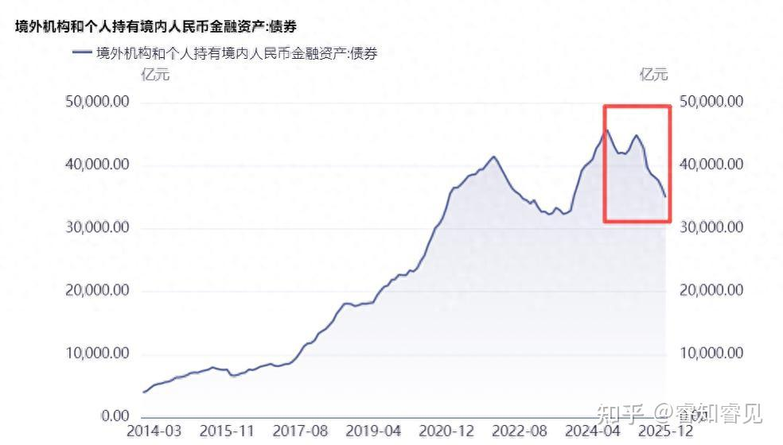
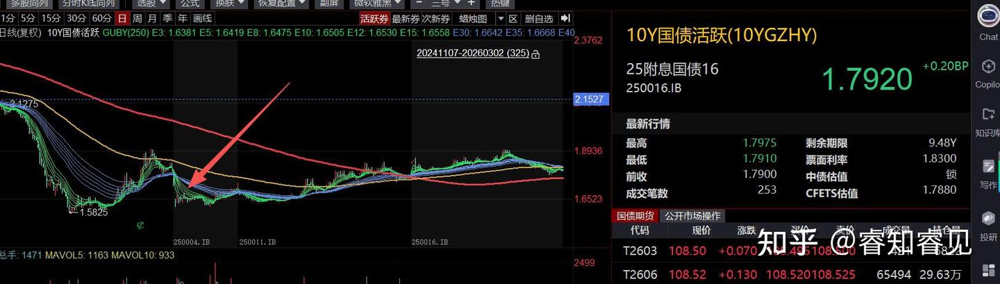
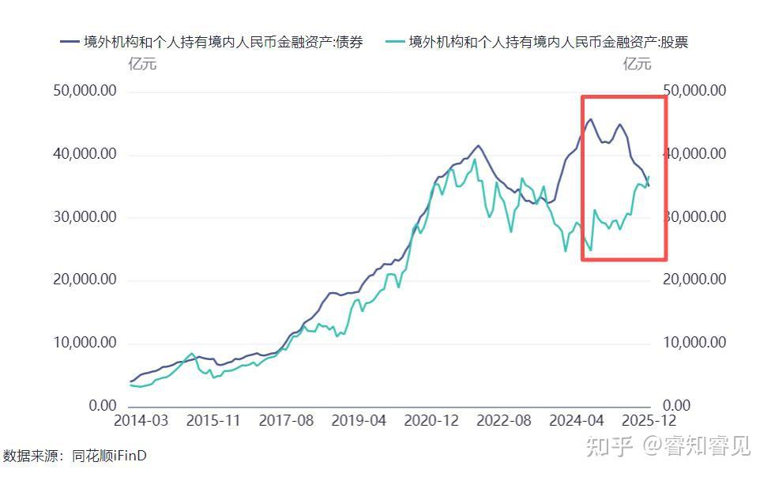
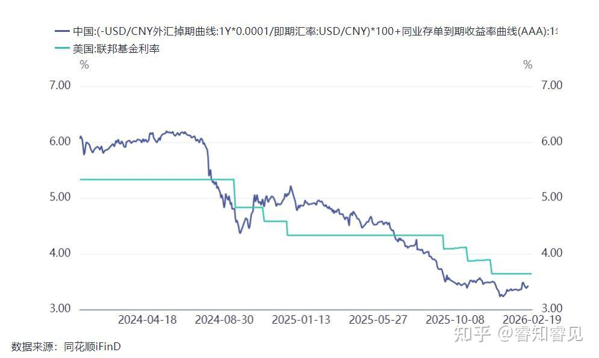
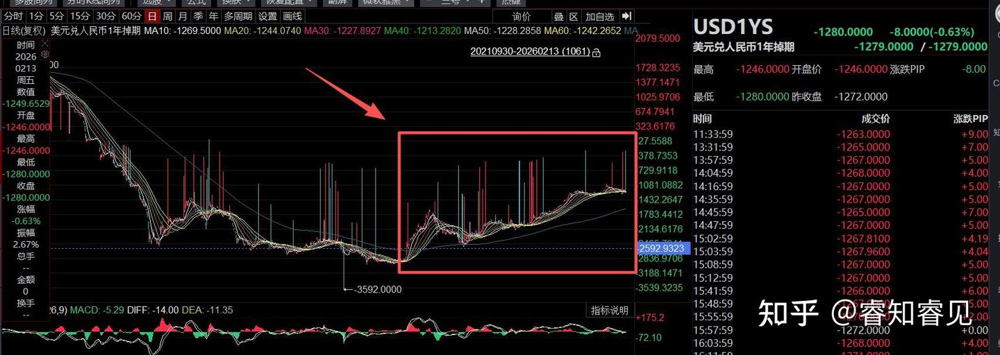
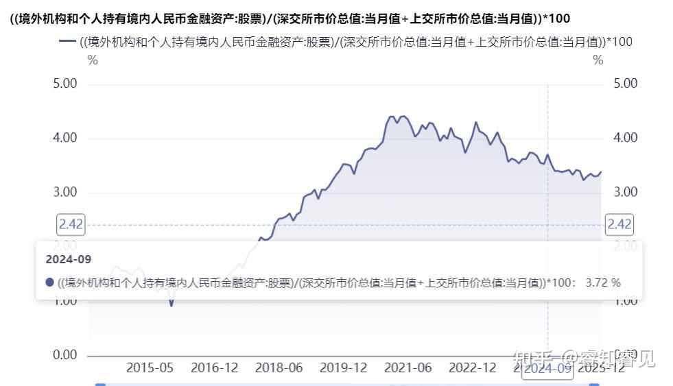
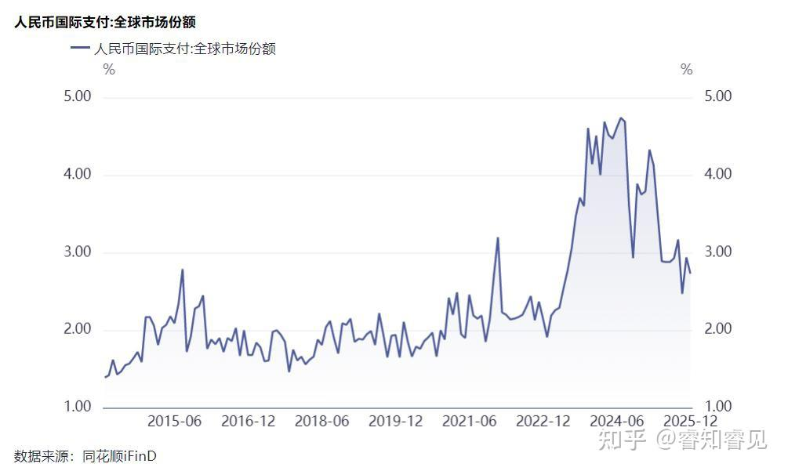
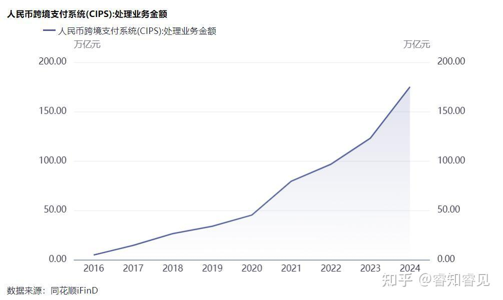
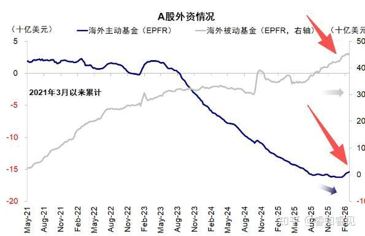
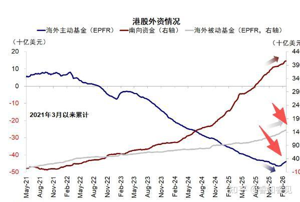

# 外资卖债与 A 股上涨背后的逻辑

> **一句话总结**：外资因套利空间消失而卖出中国债券，但并未大举买入A股，市场上涨的主力是回流的内资；同时，持有中国资产的外资正在经历从西方投机资本到“一带一路”伙伴国的结构性“换血”。

## 核心观点 (Key Takeaways)
- **外资卖债是套利逻辑的终结**：随着美联储进入降息周期，人民币贬值压力减弱，早期“做多国内债券+做空远期人民币”的套利策略失效，导致外资（主要是境外银行）抛售债券以转向美元存款。
- **A股上涨并非外资驱动**：尽管外资持有的股票市值增加，但这主要是由股价上涨驱动的。从占总市值的比例来看，外资甚至可能小幅卖出了A股。
- **外资暂未大举进入A股原因复杂**：主要原因包括西方国家的政治压力、对中国经济实力的长期误判、对资本项目未完全开放的担忧，以及国内市场更欢迎长期耐心资本而非短期投机资本。
- **外资结构正在“换血”**：随着人民币国际化推进，越来越多与中国有贸易往来的国家（如“一带一路”国家）开始持有人民币，并有配置中国资产的需求，这些新的长期投资者正在取代旧的投机性外资。
- **本轮牛市主角是“内资回流”**：中国巨大的贸易顺差形成了大规模滞留海外的内资。在国际局势紧张和美联-储降息的背景下，这些“藏汇于民”的资金正在回流，成为推动资产价格上涨的主要力量。

## 关键数据与证据 (Fact Sheet)
- **债券抛售**：自2024年9月24日以来，外资累计抛售了 **1万亿** 元人民币的国内债券。
- **股票市值**：同期，外资持有的股票市值增加了 **1.2万亿** 元人民币，但这主要是由市场上涨导致。
- **持股比例**：外资持有A股占总市值的比例实际上比2024年9月24日时更低。
- **人民币结算**：目前中国贸易中，人民币结算的占比已高于 **30%**。
- **CIPS 交易额**：2024年CIPS系统交易额达到 **175万亿** 人民币（约25万亿美元）。
- **资金流入**：EPFR口径数据显示，2026年以来，海外基金持续净流入A股和港股。

---

## 原始文本清洗版 (Original Content)

自2024年924以来，外资抛售了一万亿国内债券。

抛售的进程从2025年4月加快，也就是关税战开打那会。
10年国债利率也是从那个时候开始上升的。

对应的，A股也是在那个时候开始了第二波上涨。
如果我们把外资持有的债券和股票的市值做一下对比，会发现两者正好此消彼长。持有的股票市值增加了1.2万亿。

这里面有什么玄机呢？外资在卖债买股吗？

# 一、为什么外资要卖债？
老读者应该知道，我在924那会就已经提到过，**外资会成为国内债券最大的空头。**
原因是，美联储进入降息周期后，人民币的贬值压力将逐渐消失，甚至出现升值压力。
当初外资买中债是因为央行为了缓解资金外流和保汇率，提供了较多的掉期点补贴，使得外资可以通过“**做多国内债券+做空远期人民币**”获得高于美元存款的利率。

境外银行见到有这种便宜可以占，当然要占啦。
如果做多的是国内长债，收益率还会更高。
可一旦美联储进入降息周期，一切就会逆转过来，央行会减少掉期点补贴。那么这个对冲组合的收益率就会低于美元存款。

那么境外银行就会拆掉这个组合，去存美元存款。拆组合的过程就是在抛售国内债券。
注意，**境外银行抛售债券后，不会转而买入国内股票。**
那么谁在买A股呢？

# 二、外资买了多少股票？
需要注意的是，虽然外资持有股票的市值在增加，但这并不意味着他们整体买入了A股。
因为股市自924以后可上涨了不少！股市上涨本来也会导致外资持有的规模增加。
因此，我们应该看外资持有股票占总市值的比例。见下图。

这个比例比924当时还低。不过在2025年7月，开始反弹。
因此，总的来说，外资很可能不但没买A股，反而是卖出小部分。
这就有趣了，外资为啥不看好A股呢？他们不是所谓的聪明资金吗？
这里面的玄机就多了。
**第一，外资可能有政治压力。**
那些跟中国对抗的国家，很可能会对资本施加压力，迫使他们抛售A股股票。
不仅是二级市场，这两年，外资也减少了在中国的直接投资。比如，星巴克都把中国业务出售了。
这种政治压力很可能就是在跟咱们打金融战。
**第二，对中国的误判。**
在特朗普跟咱们打贸易战之前，大部分外资都对中国持悲观态度。
他们没有看清中国的真正实力。
在看到中国硬刚特朗普，而特朗普不断TACO后，终于认清了局势。才开始尝试加仓。
现在中国开始展示自己的综合实力了，各国都屁颠屁颠的访华了。
未来，外资很可能会逐渐加仓中国资产。
**第三，中国的资本项目没有完全开放。**
在世界局势复杂而紧张时，外资肯定会担心进得来出不去，所以不愿意加仓A股。
未来，随着资本项目逐渐开放，这些顾虑就会慢慢打消。
但这是一个缓慢的过程。
相比而言，外资会更愿意通过港股持有中国资产。毕竟香港是一个开放的市场。
也正是因为开放，所以港股对海外突发事件更加敏感。
**第四，国内并不欢迎投机类国际资本。**
别说股市了，即便是一级市场，中国都不欢迎投机的资金。
中国现在缺资金吗？根本就不缺。缺的是高端技术。
对于股市而言，国内欢迎的是耐心资本。
通过三年熊市，已经把很多投机类外资驱赶出去了。
现在外资对A股基本上没有定价权。
不过，未来，外资还会逐渐回来的。为什么呢？

# 三、外资正在换血中
随着跟中国做生意的国家越来越多，通过人民币结算的贸易越来越多。
别看现在switf系统中，人民币交易的占比只有3%左右（2024年是4%左右），但switf系统中用于贸易结算的占比只有25%左右。

Swift系统2024年的交易额是2000万亿美元，那么用于贸易的交易额是500万亿美元。
而cips2024年的交易额攀升到了175万亿人民币，大概是25万亿美元，加上switf系统中的80万亿美元，已经有105万亿美元是用人民币结算了。
现在，中国的贸易中，人民币结算的占比已经高于30%了。

2025年，人民币用于贸易结算的金额肯定还会攀升。
虽然金融交易中人民币结算的占比还很低，但在国际贸易中，人民币国际化的步伐很快。
这就会出现一个问题，跟咱们做生意的国家拿着人民币怎么存放呢？
这就需要中国提供一些他们能买的资产才行。
所以，只要人民币国际化持续推进，国家就会逐渐**将股市打造成适合机构配置的资产。**
去年，不少蓝筹去港股IPO，其中一个目的就是给外资配置中国资产的途径。IPO中的基石投资者有一半以上都是外资。
而这些外资主要是来自一带一路的国家。
因此呀，**持有中国资产的外资也在换血中。**
随着美国丢掉全球霸权，转变为区域性强国，不少外资在配置全球资产时，也会更多转向中国资产，尤其是美国把自己的獠牙露出来了，而中国始终保持合作共赢的开放姿态。
未来，中国还会激活很多发展中国家的资产配置需求。
好消息是，2026年以来，EPFR口径下，海外基金今年以来是在不断流入A股和港股的。

# 四、跨国资金回流是本轮牛市的主角
虽然本轮牛市外资的参与度很低，但跨国资金的参与度很高。甚至是主角。
注意，这里的跨国资金不是外资，而是滞留在海外的内资。
咱们国家这些年贸易顺差这么大，但外汇储备变化很小。主要是因为国家藏汇于民。让人们自行在海外进行资产配置。
随着贸易顺差越来越大，美联储降息以及国际局势紧张，这些资金就有回国的冲动。
资金多了，物价和资产价格都会回升。
现在央行所面临的反而是人民币升值压力。
它需要小心控制资金回流的速度和节奏。
至此咱们就能明白外资持有的债券规模下降和股票规模上升的原因了。
属于中国的时代正在踏步走来。
喜欢我文章的朋友欢迎来我的同名公号：**睿知睿见**
